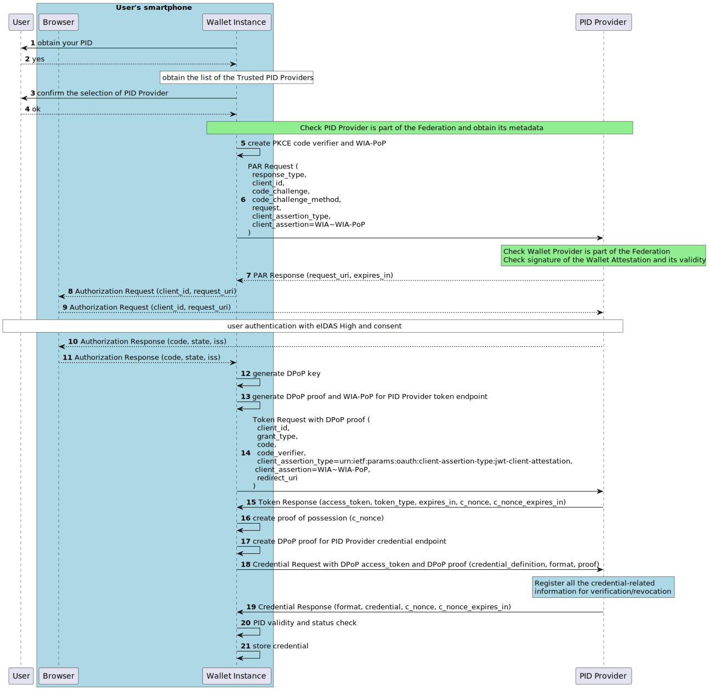

.. include:: ../common/common_definitions.rst

.. _pid_eaa_issuance.rst:

PID/(Q)EAA Issuance
+++++++++++++++++++

This section describes the PID and (Q)EAAs issuance flow with an high level of security.
The relevant entities and interfaces involved in the issuance flow are:

    - *Wallet Provider*: The entity responsible for releasing an EUDI Wallet Solution. The Wallet Provider issues the Wallet Attestations to its Wallet Instances through an Attestation Service. The Wallet Attestation certifies the genuinity and authenticity of the Wallet Instance and its compliance with the security and privacy requirements.
    - *Wallet Solution*: Entire product and service owned by a Wallet Provider, offered to all the Users and certified as EUDI-compliant by a Conformity Assessment Body (CAB).
    - *Wallet Instance*: Instance of a Wallet Solution, installed on the User device. The Wallet Instance provides graphical interfaces for User interaction with Relying Parties, PID, (Q)EAA Providers and the Wallet Provider.
    - *PID Provider*: The entity that issues the eIDAS Person Identification Data (PID). It is composed of:

        - OpenID4VCI Component: based on the "OpenID for Verifiable Credential Issuance" specification  ` [OIDC4VCI. Draft 13] <https://openid.net/specs/openid-4-verifiable-credential-issuance-1_0.html>`_ to release the PID.
        - National eID Relying Party: The component to authenticate the User with the national Digital Identity Providers, based on OpenID Connect Core 1.0 or SAML2.
        - National Identity Provider: It represents preexisting identity systems based on SAML2 or OpenID Connect Core 1.0, already in production in each Member State (eg: the Italian SPID and CIE id schemes notified eIDAS with *LoA* **High**, see `SPID/CIE OpenID Connect Specifications <https://italia.github.io/spid-cie-oidc-docs/en/>`_).

    - *(Q)EAA Provider*: It represents the Issuer of (Q)EAAs. It is composed of:

      - OpenID4VCI Component: based on the "OpenID for Verifiable Credential Issuance" specification to release (Q)EAAs.
      - Relying Party: Component to authenticate the User with the PID. The (Q)EAA Provider acts as a Verifier by sending a presentation request to the Wallet Instance, according to [`OpenID4VP`_]. The Wallet Instance MUST have a valid PID, obtained in a previous time, to get authenticated with the (Q)EAA Provider.

High-Level PID flow
-------------------

The :numref:`fig_High-Level-Flow-ITWallet-PID-Issuance` shows a general architecture and highlights the main operations involved in the issuance of a PID.

.. _fig_High-Level-Flow-ITWallet-PID-Issuance:
.. figure:: ../../images/High-Level-Flow-ITWallet-PID-Issuance.svg
    :figwidth: 100%
    :align: center

    PID Issuance - General architecture and high level flow.

Below the description of the steps represented in the previous picture:

    0. **Wallet Instance Setup**: the first time the Wallet Instance is started a preliminary setup phase is carried out. It consists of the release of the Wallet Attestation issued by Wallet Attestation Service asserting the genuineness and the compliance of the Wallet Instance with the shared trust framework. The Wallet Attestation binds the public key provided by the Wallet Instance, related to one of the private keys generated by the Wallet Instance.
    1. **PID/(Q)EAA Provider Discovery**: the Wallet Instance discovers the trusted Digital Credential Issuers using the Federation API (e.g.: using the Subordinate Listing Endpoint of the Trust Anchor and its Intermediates), inspecting the Credential Issuer metadata and Trust Marks for filtering the PID Provider.
    2. **PID Provider Metadata**: the Wallet Instance establishes the trust to the PID Provider according to the Trust Model and obtains the Metadata that discloses the formats of the PID, the algorithms supported, and any other parameter required for interoperability needs.
    3. **PID Request**: using the Authorization Code Flow defined in `[OIDC4VCI. Draft 13] <https://openid.net/specs/openid-4-verifiable-credential-issuance-1_0.html>`_ the Wallet Instance requests the PID to the PID Provider.
    4. **User Authentication**: the PID Provider authenticates the User with LoA High, acting as an Identity and Access Management Proxy to the National eID system.
    5. **PID Issuance**: the User is authenticated with LoA High and the PID Provider releases a PID bound to the key material held by the requesting Wallet Instance.

In the following sections the steps from 1 to 5 are further expanded into more technical details.

High-Level (Q)EAA flow
----------------------

The :numref:`fig_High-Level-Flow-ITWallet-QEAA-Issuance` shows a general architecture and highlights the main operations involved in the issuance of a (Q)EAA, following the assumptions listed below:

  - the User has a valid PID stored in their own Wallet Instance;
  - the (Q)EAA requires a high security implementation profile.

.. _fig_High-Level-Flow-ITWallet-QEAA-Issuance:
.. figure:: ../../images/High-Level-Flow-ITWallet-QEAA-Issuance.svg
    :figwidth: 70%
    :align: center

    (Q)EAA Issuance - General architecture and high level flow

Below the description of the most relevant operations involved in the (Q)EAA issuance:

    1. **Discovery of the trusted (Q)EAA Provider**: the Wallet Instance obtains the list of the trusted (Q)EAA Provider using the Federation API (e.g.: using the Subordinate Listing Endpoint of the Trust Anchor and its Intermediates), then inspects the metadata and Trust Mark looking for the Digital Credential capabilities of each (Q)EAA Provider.
    2. **(Q)EAA Provider Metadata**: the Wallet Instance establishes the trust to the (Q)EAA Provider according to the Trust Model, obtaining the Metadata that discloses the formats of the (Q)EAA, the algorithms supported, and any other parameter required for interoperability needs.
    3. **(Q)EAA Request**: using the Authorization Code Flow , defined in `[OIDC4VCI. Draft 13] <https://openid.net/specs/openid-4-verifiable-credential-issuance-1_0.html>`_, the Wallet Instance requests a (Q)EAA to the (Q)EAA Provider.
    4. **User Authentication**: the (Q)EAA Provider, acting as a Verifier (Relying Party), authenticates the User evaluating the presentation of the PID.
    5. **(Q)EAA Issuance**: the User is authenticated with a valid PID and the (Q)EAA Provider releases a (Q)EAA bound to the key material held by the requesting Wallet Instance.

Detailed Flow
-------------

The PID/(Q)EAA Issuance phase uses the **Authorization Code Flow** with the following specifications:

* **Pushed Authorization Requests** (PAR) [:rfc:`9126`];
* **PKCE** (Proof Key for Code Exchange, :rfc:`7636`) as recommended in `[OIDC4VCI. Draft 13. Section 3.4] <https://openid.net/specs/openid-4-verifiable-credential-issuance-1_0.html#section-3.4>`_.

In this section a *Wallet Initiated Flow* is outlined, where the User receives the PID/(Q)EAA directly in response to the Credential Request.

.. warning::

  All the non-normative examples are referred to the PID Provider issuance flow.

.. _fig_Low-Level-Flow-ITWallet-PID-QEAA-Issuance:

G29LWBbST0iue5VA6Si8zXKTTF3kyMxzi5931kyHQl8CTjj_FxZW6Il8s_a8gQyX3USVf5rfpPPSqsTuhB5aiYQMoDEK2W92CDYNAOGPYLhhJtSFd-vNgp_KpHxBbqaca0SXFuBw3ULGzpsqgOvaYJqqoBhIh7E449c3W7Ie6M7p-yrA05S8qfosXAulyhXUpZTsCyIJn6-Mzt2FVmVq39TF1i2XRwtnMF2XnLayAMj2mmLLwJyfMfJxE4IpmpUE2e6tjodOfSfv6UqzkiXgsY2_UIym_nsWFfaho7LyIyNag1yHSaZmj3EQWyCXv5XXoOoUJvf7iLzrJHNn0JAr5IMdZVeboU1ou5i4HpF0hoqvz0MPgsJQw5gzW6KGVHpza_gCufzaXgpCbGgwpwIVJbGJtMRXk0J1HpT8BScYCXNhYFU0wzlbdt0dAzspBoCdm-Uy1T4Pc562Q8OPH1Nb3ta_4kX-9Ybpz0vD71_2hTW1Nl3mpRlMMRlDVGvRwwOxnlO53GYZrf9GonRXGMv6KPCUMT7ByqNOEMquCx6jicquRjstdVy-EBCWvEr2lAeRlx1n98iKEnzZvp5syLV7y-FDoQDI_BkxCwnWHGxBtXDFqOcKn4kCyo7eiaJlYrwYML8gqSkSF8EoCDQKE7uKcStFtw6adlosrdkf7iT-EMJsuTFuNFApsKb85Ishwt60sVnkJhVdGyofzGR9HtkgMrIu9KEzjh5_etcMegxUUeEkFtzPgNlSaUUuKNKTtv8CvjnXBQGgK6HIDIdSyqhsIBltgyDNcpuXVsI6EUNCic4DwB9kFpmQ4VNqgaKnefs2XpA-ZLcSP-joEkgZW0jD_Hy0

    PID/(Q)EAA Issuance - Detailed flow

**Steps 1-4 (Discovery):** The User selects the PID/(Q)EAA Provider using the Wallet Instance, the Metadata for the selected PID/(Q)EAA Provider are processed by the Wallet Instance.

.. note::

    **Federation Check:** The Wallet Instance needs to check if the PID/(Q)EAA Provider is part of the Federation, obtaining its protocol specific Metadata. A non-normative example of a response from the endpoint **.well-known/openid-federation** with the **Entity Configuration** and the **Metadata** of the PID/(Q)EAA Provider is represented within the section `Entity Configuration Credential Issuer`_.

**Steps 5-6 (PAR Request):** The Wallet Instance:

  * creates a fresh PKCE code verifier, Wallet Attestation Proof of Possession, and ``state`` parameter for the *Pushed Authorization Request*.
  * provides to the PID/(Q)EAA Provider PAR endpoint the parameters previously listed above, using the ``request`` parameter (hereafter Request Object) according to :rfc:`9126` Section 3 to prevent Request URI swapping attack.
  * MUST create the ``code_verifier`` with enough entropy random string using the unreserved characters with a minimum length of 43 characters and a maximum length of 128 characters, making it impractical for an attacker to guess its value. The value MUST be generated following the recommendation in Section 4.1 of :rfc:`7636`.
  * signs this request using the private key that is created during the setup phase to obtain the Wallet Attestation. The related public key that is attested by the Wallet Provider is provided within the Wallet Attestation ``cnf`` claim.
  * MUST create the value of the ``client_assertion`` parameter according to OAuth 2.0 Attestation-based Client Authentication [`oauth-attestation-draft <https://vcstuff.github.io/draft-ietf-oauth-attestation-based-client-auth/draft-ietf-oauth-attestation-based-client-auth.html>`_], since in this flow the Pushed Authorization Endpoint is a protected endpoint. The ``client_assertion`` value MUST NOT contain more or less than precisely two JWTs separated with the ``~`` character. The first JWT MUST be the Wallet Attestation JWT and the second JWT MUST be the Wallet Attestation Proof of Possession.
  * specifies the types of the requested credentials using the ``authorization_details`` [RAR :rfc:`9396`] parameter.

The PID/(Q)EAA Provider performs the following checks upon the receipt of the PAR request:

    1. It MUST validate the signature of the Request Object using the algorithm specified in the ``alg`` header parameter (:rfc:`9126`, :rfc:`9101`) and the public key retrieved from the Wallet Attestation (``cnf.jwk``) referenced in the Request Object, using the ``kid`` JWS header parameter.
    2. It MUST check that the used algorithm for signing the request in the ``alg`` header is one of the listed within the Section `Cryptographic Algorithms <algorithms.html>`_.
    3. It MUST check that the ``client_id`` in the request body of the PAR request matches the ``client_id`` claim included in the Request Object.
    4. It MUST check that the ``iss`` claim in the Request Object matches the ``client_id`` claim in the Request Object (:rfc:`9126`, :rfc:`9101`).
    5. It MUST check that the ``aud`` claim in the Request Object is equal to the PID/(Q)EAA Provider authorization endpoint uri (:rfc:`9126`, :rfc:`9101`).
    6. It MUST reject the PAR request, if it contains the ``request_uri`` parameter (:rfc:`9126`).
    7. It MUST check that the Request Object contains all the mandatory parameters which values are validated according to :ref:`Table of the HTTP parameters <table_request_object_claim>` [derived from :rfc:`9126`].
    8. It MUST check that the Request Object is not expired, checking the ``exp`` claim (:rfc:`9126`).
    9. It MUST check that the Request Object was issued in a previous time than the value exposed in the ``iat`` claim. It SHOULD reject the request if the ``iat`` claim is far from the current time (:rfc:`9126`) of more than `5` minutes.
    10. It MUST check that the ``jti`` claim in the Request Object has not been used before by the Wallet Instance identified by the ``client_id``. This allows the PID/(Q)EAA Provider to mitigate replay attacks (:rfc:`7519`).
    11. It MUST validate the ``client_assertion`` parameter based on Sections 4.1 and 4.2 of [`oauth-attestation-draft <https://vcstuff.github.io/draft-ietf-oauth-attestation-based-client-auth/draft-ietf-oauth-attestation-based-client-auth.html>`_].

Below a non-normative example of the PAR.

.. code-block:: http

    POST /as/par HTTP/1.1
    Host: pid-provider.example.org
    Content-Type: application/x-www-form-urlencoded

    response_type=code
    &client_id=$thumprint-of-the-jwk-in-the-cnf-wallet-attestation$
    &code_challenge=E9Melhoa2OwvFrEMTJguCHaoeK1t8URWbuGJSstw-cM
    &code_challenge_method=S256
    &request=$SIGNED-JWT
    &client_assertion_type=urn:ietf:params:oauth:client-assertion-type:jwt-client-attestation
    &client_assertion=$WIA~WIA-PoP

Below an non-normative example of the Wallet Attestation Proof of Possession without encoding and signature applied:

.. code-block::

  {
    "alg": "ES256",
    "kid": "vbeXJksM45xphtANnCiG6mCyuU4jfGNzopGuKvogg9c",
    "typ": "jwt-client-attestation-pop",
  }
  .
  {
    "iss": "vbeXJksM45xphtANnCiG6mCyuU4jfGNzopGuKvogg9c",
    "aud": "https://pid-provider.example.org/par-endpoint",
    "jti": "ad25868c-8377-479b-8094-46fb1e797625",
    "iat": 1686645115,
    "exp": 1686652315
  }

Below an non-normative example of the signed Request Object without encoding and signature applied:

.. code-block::

  {
    "alg": "ES256",
    "kid": "FifYx03bnosD8m6gYQIfNHNP9cM_Sam9Tc5nLloIIrc",
  }
  .
  {
  "iss":"$thumprint-of-the-jwk-in-the-cnf-wallet-attestation$",
  "aud":"https://pid-provider.example.org",
  "exp":1672422065,
  "iat": 1672418465,
  "jti":"ac80df576e7109686717bf50b869e882",
  "response_type":"code",
  "client_id":"$thumprint-of-the-jwk-in-the-cnf-wallet-attestation$",
  "state":"fyZiOL9Lf2CeKuNT2JzxiLRDink0uPcd",
  "code_challenge":"E9Melhoa2OwvFrEMTJguCHaoeK1t8URWbuGJSstw-cM",
  "code_challenge_method":"S256",
  "authorization_details":[
    {
      "type": "openid_credential",
      "credential_configuration_id": "PersonIdentificationData"
    }
  ],
  "redirect_uri":"eudiw://start.wallet.example.org",
  }

.. note::

    **Federation Check:** The PID/(Q)EAA Provider MUST check that the Wallet Provider is part of the federation.

.. note::
   The PID/(Q)EAA Provider MUST validate the signature of the the Wallet Attestation and that it is not expired.

**Step 7 (PAR Response):**  The PID/(Q)EAA Provider provides a one-time use ``request_uri`` value. The issued ``request_uri`` value must be bound to the client identifier (``client_id``) that was provided in the Request Object.

.. note::
    The entropy of the ``request_uri`` MUST be sufficiently large. The adequate shortness of the validity and the entropy of the ``request_uri`` depends on the risk calculation based on the value of the resource being protected. The validity time SHOULD be less than a minute, and the ``request_uri`` MUST include a cryptographic random value of 128 bits or more (:rfc:`9101`). The entire ``request_uri`` SHOULD NOT exceed 512 ASCII characters due to the following two main reasons (:rfc:`9101`):

        1. Many phones on the market still do not accept large payloads. The restriction is typically either 512 or 1024 ASCII characters.
        2. On a slow connection such as a 2G mobile connection, a large URL would cause a slow response; therefore, the use of such is not advisable from the user-experience point of view.

The PID/(Q)EAA Provider returns the issued ``request_uri`` to the Wallet Instance. A non-normative example of the response is shown below.

.. code-block:: http

    HTTP/1.1 201 Created
    Cache-Control: no-cache, no-store
    Content-Type: application/json

    {
        "request_uri":"urn:ietf:params:oauth:request_uri:bwc4JK-ESC0w8acc191e-Y1LTC2",
        "expires_in": 60
    }

**Steps 8-9 (Authorization Request):** The Wallet Instance sends an authorization request to the PID/(Q)EAA Provider Authorization Endpoint. Since parts of this Authorization Request content, e.g., the ``code_challenge`` parameter value, are unique to a particular Authorization Request, the Wallet Instance MUST only use a ``request_uri`` value once (:rfc:`9126`); The  PID/(Q)EAA Provider performs the following checks upon the receipt of the Authorization Request:

    1. It MUST treat ``request_uri`` values as one-time use and MUST reject an expired request. However, it MAY allow for duplicate requests due to a user reloading/refreshing their user-agent (derived from :rfc:`9126`).
    2. It MUST identify the request as a result of the submitted PAR (derived from :rfc:`9126`).
    3. It MUST reject all the Authorization Requests that do not contain the ``request_uri`` parameter as the PAR is the only way to pass the Authorization Request from the Wallet Instance (derived from :rfc:`9126`).

.. code-block:: http

    GET /authorize?client_id=$thumprint-of-the-jwk-in-the-cnf-wallet-attestation$&request_uri=urn%3Aietf%3Aparams%3Aoauth%3Arequest_uri%3Abwc4JK-ESC0w8acc191e-Y1LTC2 HTTP/1.1
    Host: pid-provider.example.org

.. note::

   **User Authentication and Consent:** The PID Provider performs the User authentication based on the requirements of eIDAS LoA High by means of national notified eIDAS scheme and requires the User consent for the PID issuance.
   The (Q)EAA Provider performs the User authentication requesting a valid PID to the Wallet Instance. The (Q)EAA Provider MUST use [`OpenID4VP`_] to dynamically request the presentation of the PID. From a protocol perspective, the (Q)EAA Provider acts as a Relying Party, providing the presentation request to the Wallet Instance. The Wallet Instance MUST have a valid PID obtained prior to start the transaction with the (Q)EAA Provider.

**Steps 10-11 (Authorization Response):** The PID/(Q)EAA Provider sends an authorization ``code`` together with ``state`` and ``iss`` parameters to the Wallet Instance. The Wallet Instance performs the following checks on the Authorization Response:

    1. It MUST check the Authorization Response contains all the defined parameters according to :ref:`Table of the HTTP Response parameters <table_http_response_claim>`.
    2. It MUST check the returned value by the PID/(Q)EAA Provider for ``state`` parameter is equal to the value sent by Wallet Instance in the Request Object (:rfc:`6749`).
    3. It MUST check that the URL of PID/(Q)EAA Provider in ``iss`` parameter is equal to the URL identifier of intended PID/(Q)EAA Provider that the Wallet Instance start the communication with (:rfc:`9027`).

.. note::

    The Wallet Instance redirect URI is a universal or app link registered with the local operating system, so this latter will resolve it and pass the response to the Wallet Instance.

.. code-block:: http

    HTTP/1.1 302 Found
    Location: https://start.wallet.example.org?code=SplxlOBeZQQYbYS6WxSbIA&state=fyZiOL9Lf2CeKuNT2JzxiLRDink0uPcd&iss=https%3A%2F%2Fpid-provider.example.org

**Steps 12-13 (DPoP Proof for Token Endpoint)**: The Wallet Instance MUST create a new key pair for the DPoP and a fresh DPoP Proof JWT following the instruction provided in Section 4 of (:rfc:`9449`) for the token request to the PID/(Q)EAA Provider. The DPoP Proof JWT is signed using the private key for DPoP created by Wallet Instance for this scope. DPoP binds the Access Token to a certain Wallet Instance (:rfc:`9449`) and mitigates the misuse of leaked or stolen Access Tokens at the Credential Endpoint.

**Step 14 (Token Request):** The Wallet Instance sends a token request to the PID/(Q)EAA Provider Token Endpoint with a *DPoP Proof JWT*  and the parameters: ``code``, ``code_verifier``, and OAuth 2.0 Attestation based Client Authentication  (``client_assertion_type=urn:ietf:params:oauth:client-assertion-type:jwt-client-attestation`` and ``client_assertion=WIA~WIA-PoP``). 
The ``client_assertion`` is signed using the private key that is created during the setup phase to obtain the Wallet Attestation. The related public key that is attested by the Wallet Provider is provided within the Wallet Attestation (``cnf`` claim). The PID/(Q)EAA Provider performs the following checks on the Token Request:

   1. It MUST ensure that the Authorization ``code`` is issued to the authenticated Wallet Instance (:rfc:`6749`) and was not replied.
   2. It MUST ensure the Authorization ``code`` is valid and has not been previously used (:rfc:`6749`).
   3. It MUST ensure the ``redirect_uri`` matches the value included in the previous Request Object `OpenID.Core#TokenRequest <https://openid.net/specs/openid-connect-core-1_0.html#TokenRequest>`_.
   4. It MUST validate the DPoP Proof JWT, according to (:rfc:`9449`) Section 4.3.

.. code-block:: http

    POST /token HTTP/1.1
    Host: pid-provider.example.org
    Content-Type: application/x-www-form-urlencoded
    DPoP: eyJ0eXAiOiJkcG9wK2p3dCIsImFsZyI6IkVTMjU2IiwiandrIjp7Imt0eSI6Ik
        VDIiwieCI6Imw4dEZyaHgtMzR0VjNoUklDUkRZOXpDa0RscEJoRjQyVVFVZldWQVdCR
        nMiLCJ5IjoiOVZFNGpmX09rX282NHpiVFRsY3VOSmFqSG10NnY5VERWclUwQ2R2R1JE
        QSIsImNydiI6IlAtMjU2In19.eyJqdGkiOiItQndDM0VTYzZhY2MybFRjIiwiaHRtIj
        oiUE9TVCIsImh0dSI6Imh0dHBzOi8vc2VydmVyLmV4YW1wbGUuY29tL3Rva2VuIiwia
        WF0IjoxNTYyMjYyNjE2fQ.2-GxA6T8lP4vfrg8v-FdWP0A0zdrj8igiMLvqRMUvwnQg
        4PtFLbdLXiOSsX0x7NVY-FNyJK70nfbV37xRZT3Lg

    grant_type=authorization_code
    &code=SplxlOBeZQQYbYS6WxSbIA
    &code_verifier=dBjftJeZ4CVP-mB92K27uhbUJU1p1r_wW1gFWFOEjXk
    &redirect_uri=https://start.wallet.example.org/cb
    &client_assertion_type=urn:ietf:params:oauth:client-assertion-type:jwt-client-attestation
    &client_assertion=$WIA~WIA-PoP

**Step 15 (Token Response):** The PID/(Q)EAA Provider validates the request, if successful an *Access Token* (bound to the DPoP key) and a fresh `c_nonce` are provided by the Issuer to the Wallet Instance. The parameter `c_nonce` is a string value, which MUST be unpredictable and is used later by the Wallet Instance in Step 18 to create the proof of possession of the key (*proof* claim) and it is the primary countermeasure against key proof replay attack. Note that, the received `c_nonce` value can be used to create the proof as long as the Issuer provides the Wallet Instance with a new `c_nonce` value. 

.. code-block:: 

    HTTP/1.1 200 OK
    Content-Type: application/json
    Cache-Control: no-store

    {
        "access_token": "Kz~8mXK1EalYznwH-LC-1fBAo.4Ljp~zsPE_NeO.gxU ...",
        "token_type": "DPoP",
        "expires_in": 2677,
        "c_nonce": "tZign[...]snFbp",
        "c_nonce_expires_in": 86400,
        "authorization_details": [
          {
              "type": "openid_credential",
              "credential_configuration_id: "PersonIdentificationData"
              }
          }
        ]
    }

**Steps 16-17 (DPoP Proof for Credential Endpoint):** The Wallet Instance for requesting the Digital Credential creates a proof of possession with ``c_nonce`` obtained in **Step 15** and using the private key used for the DPoP, signing a DPoP Proof JWT according to (:rfc:`9449`) Section 4. The ``jwk`` value in the ``proof`` parameter MUST be equal to the public key referenced in the DPoP.

**Step 18 (Credential Request):** The Wallet Instance sends a request for the Digital Credential to the PID/(Q)EAA Credential endpoint. This request MUST include the Access Token, DPoP Proof JWT, credential type, proof (which demonstrates possession of the key), and format parameters. The proof parameter MUST be an object that contains evidence of possession of the cryptographic key material to which the issued PID/(Q)EAA Digital Credential will be bound. To verify the proof, the PID/(Q)EAA Provider conducts the following checks at the Credential endpoint:

 1. the JWT proof MUST include all required claims as specified in the table of Section :ref:`Token Request <sec_token_request>`;
 2. The key proof MUST be explicitly typed using header parameters as defined for the respective proof type;
 3. The header parameter alg MUST indicate a registered asymmetric digital signature algorithm, and MUST NOT be set to `none`;
 4. The signature on the key proof MUST be verified using the public key specified in the header parameter.
 5. The header parameter MUST NOT contain a private key.
 6. If a `c_nonce` value was previously provided by the server, the nonce claim in the JWT MUST match this `c_nonce` value. Furthermore, the creation time of the JWT, as indicated by the `iat` claim or a server-managed timestamp via the nonce claim, MUST be within an acceptable window of time as determined by the server.

.. note::

    **PID/(Q)EAA Credential Schema and Status registration:** The PID/(Q)EAA Provider MUST register all the issued Credentials for their later revocation, if needed.

.. code-block::

  POST /credential HTTP/1.1
  Host: pid-provider.example.org
  Content-Type: application/json
  Authorization: DPoP Kz~8mXK1EalYznwH-LC-1fBAo.4Ljp~zsPE_NeO.gxU
  DPoP: eyJ0eXAiOiJkcG9wK2p3dCIsImFsZyI6IkVTMjU2IiwiandrIjp7Imt0eSI6Ik
      VDIiwieCI6Imw4dEZyaHgtMzR0VjNoUklDUkRZOXpDa0RscEJoRjQyVVFVZldWQVdCR
      nMiLCJ5IjoiOVZFNGpmX09rX282NHpiVFRsY3VOSmFqSG10NnY5VERWclUwQ2R2R
      1JEQSIsImNydiI6IlAtMjU2In19.eyJqdGkiOiJlMWozVl9iS2ljOC1MQUVCIiwiaHRtIj
      oiR0VUIiwiaHR1IjoiaHR0cHM6Ly9yZXNvdXJjZS5leGFtcGxlLm9yZy9wcm90ZWN0Z
      WRyZXNvdXJjZSIsImlhdCI6MTU2MjI2MjYxOCwiYXRoIjoiZlVIeU8ycjJaM0RaNTNF
      c05yV0JiMHhXWG9hTnk1OUlpS0NBcWtzbVFFbyJ9.2oW9RP35yRqzhrtNP86L-Ey71E
      OptxRimPPToA1plemAgR6pxHF8y6-yqyVnmcw6Fy1dqd-jfxSYoMxhAJpLjA
  {
    "format": "vc+sd-jwt"
    "credential_definition":{
      "type": ["PersonIdentificationData"]
    },
    "proof": {
      "proof_type": "jwt",
      "jwt": "eyJraWQiOiJkaWQ6ZXhhbXBsZTplYm"
    }
  }

Where a non-normative example of the decoded content of the ``jwt`` parameter is represented below,
without encoding and signature. The JWS header:

.. code-block:: JSON

  {
    "alg": "ES256",
    "typ": "openid4vci-proof+jwt",
    "jwk": {
      "kty": "EC",
      "x": "l8tFrhx-34tV3hRICRDY9zCkDlpBhF42UQUfWVAWBFs",
      "y": "9VE4jf_Ok_o64zbTTlcuNJajHmt6v9TDVrU0CdvGRDA",
      "crv": "P-256"
    }

  }

And the JWS payload:

.. code-block:: JSON

    {
        "iss": "0b434530-e151-4c40-98b7-74c75a5ef760",
        "aud": "https://pid-provider.example.org/credential",
        "iat": 1504699136,
        "nonce": "tZign...snFbp"
    }

**Steps 19-21 (Credential Response):** The PID/(Q)EAA Provider MUST validate the *DPoP JWT Proof* based on the steps defined in Section 4.3 of (:rfc:`9449`) and whether the *Access Token* is valid and suitable for the requested PID/(Q)EAA. It also MUST validate the proof of possession for the key material the new credential SHALL be bound to, according to `OPENID4VCI`_ Section 7.2.2. If all checks succeed, the PID/(Q)EAA Provider creates a new Credential bound to the key material and provide it to the Wallet Instance. The Wallet Instance MUST perform the following checks before proceeding with the secure storage of the PID/(Q)EAA:

    1. It MUST check that the PID Credential Response contains all the mandatory parameters and values are validated according to :ref:`Table of the credential response parameters <table_credential_response_claim>`.
    2. It MUST check the PID integrity by verifying the signature using the algorithm specified in the ``alg`` header parameter of SD-JWT (:ref:`PID/(Q)EAA Data Model <pid_eaa_data_model.rst>`) and the public key that is identified using using the ``kid`` header of the SD-JWT.
    3. It MUST check that the received PID (in credential claim) matches the schema defined in :ref:`PID/(Q)EAA Data Model <pid_eaa_data_model.rst>`.
    4. It MUST process and verify the PID in SD-JWT VC format (according to `SD.JWT#Verification <https://drafts.oauth.net/oauth-selective-disclosure-jwt/draft-ietf-oauth-selective-disclosure-jwt.html#name-verification-and-processing>`_ Section 6.) or MDOC CBOR format. 
    5. It MUST verify the Trust Chain in the header of SD-JWT VC to verify that the PID Provider is trusted.

If the checks defined above are successful the Wallet Instance proceeds with the secure storage of the PID/(Q)EAA.

.. code-block:: http

    HTTP/1.1 200 OK
    Content-Type: application/json
    Cache-Control: no-store
    Pragma: no-cache

    {
        "format": "vc+sd-jwt"
        "credential" : "LUpixVCWJk0eOt4CXQe1NXK[...]WZwmhmn9OQp6YxX0a2L",
        "c_nonce": "fGFF7[...]UkhLa",
        "c_nonce_expires_in": 86400
    }

Pushed Authorization Request Endpoint
-------------------------------------

Pushed Authorization Request (PAR) Request
^^^^^^^^^^^^^^^^^^^^^^^^^^^^^^^^^^^^^^^^^^

The requests to the PID/(Q)EAA authorization endpoint MUST use the HTTP POST method with the parameters in the message body encoded in ``application/x-www-form-urlencoded`` format. The Pushed Authorization Endpoint is protected with OAuth 2.0 Attestation-based Client Authentication [`oauth-attestation-draft <https://vcstuff.github.io/draft-ietf-oauth-attestation-based-client-auth/draft-ietf-oauth-attestation-based-client-auth.html>`_] and the following parameters MUST be provided:

.. _table_http_request_claim:
.. list-table:: PAR http request parameters
    :widths: 20 60 20
    :header-rows: 1

    * - **Claim**
      - **Description**
      - **Reference**
    * - **response_type**
      - MUST be set to ``code``.
      - :rfc:`6749`
    * - **client_id**
      - MUST be set to the thumbprint of the ``jwk`` value in the ``cnf`` parameter inside the Wallet Attestation.
      - :rfc:`6749`
    * - **code_challenge**
      - A challenge derived from the **code verifier** that is sent in the authorization request.
      - :rfc:`7636#section-4.2`.
    * - **code_challenge_method**
      - A method that was used to derive **code challenge**. It MUST be set to ``S256``.
      - :rfc:`7636#section-4.3`.
    * - **request**
      - It MUST be a signed JWT. The private key corresponding to the public one in the ``cnf`` parameter inside the Wallet Attestation MUST be used for signing the Request Object.
      - `OpenID Connect Core. Section 6 <https://openid.net/specs/openid-connect-core-1_0.html#JWTRequests>`_
    * - **client_assertion_type**
      - It MUST be set to ``urn:ietf:params:oauth:client-assertion-type:jwt-client-attestation``.
      - `oauth-attestation-draft <https://vcstuff.github.io/draft-ietf-oauth-attestation-based-client-auth/draft-ietf-oauth-attestation-based-client-auth.html>`_.
    * - **client_assertion**
      - It MUST be set to a value containing the Wallet Attestation JWT and the Proof of Possession, separated with the ``~`` character.
      - `oauth-attestation-draft <https://vcstuff.github.io/draft-ietf-oauth-attestation-based-client-auth/draft-ietf-oauth-attestation-based-client-auth.html>`_.

The JWT *Request Object* has the following JOSE header parameters:

.. _table_request_object_claim:
.. list-table::
    :widths: 20 60 20
    :header-rows: 1

    * - **JOSE header**
      - **Description**
      - **Reference**
    * - **alg**
      - A digital signature algorithm identifier such as per IANA "JSON Web Signature and Encryption Algorithms" registry. It MUST be one of the supported algorithms listed in the Section `Cryptographic Algorithms <algorithms.html>`_ and MUST NOT be set to ``none`` or any symmetric algorithm (MAC) identifier.
      - :rfc:`7516#section-4.1.1`.
    * - **kid**
      -  Unique identifier of the ``jwk`` inside the ``cnf`` claim of Wallet Attestation as base64url-encoded JWK Thumbprint value.
      - :rfc:`7638#section_3`.

.. note::
  The parameter **typ**, if omitted, assumes the implicit value **JWT**.

The JWT payload is given by the following parameters:

.. _table_jwt_request:
.. list-table::
    :widths: 20 60 20
    :header-rows: 1

    * - **Claim**
      - **Description**
      - **Reference**
    * - **iss**
      - It MUST be set to the ``client_id``.
      - :rfc:`9126` and :rfc:`7519`.
    * - **aud**
      - It MUST be set to the identifier of the PID/(Q)EAA Provider.
      - :rfc:`9126` and :rfc:`7519`.
    * - **exp**
      - UNIX Timestamp with the expiry time of the JWT.
      - :rfc:`9126` and :rfc:`7519`.
    * - **iat**
      - UNIX Timestamp with the time of JWT issuance.
      - :rfc:`9126` and :rfc:`7519`.
    * - **response_type**
      - It MUST be set as in the :ref:`Table of the HTTP parameters <table_http_request_claim>`.
      - See :ref:`Table of the HTTP parameters <table_http_request_claim>`.
    * - **client_id**
      - It MUST be set as in the :ref:`Table of the HTTP parameters <table_http_request_claim>`.
      - See :ref:`Table of the HTTP parameters <table_http_request_claim>`.
    * - **state**
      - Unique session identifier at the client side. This value will be returned to the client in the response, at the end of the authentication. It MUST be a random string composed by alphanumeric characters and with a minimum length of 32 digits.
      - See `OpenID.Core#AuthRequest <https://openid.net/specs/openid-connect-core-1_0.html#AuthRequest>`_.
    * - **code_challenge**
      - It MUST be set as in the :ref:`Table of the HTTP parameters <table_http_request_claim>`.
      - See :ref:`Table of the HTTP parameters <table_http_request_claim>`.
    * - **code_challenge_method**
      - It MUST be set as in the :ref:`Table of the HTTP parameters <table_http_request_claim>`.
      - See :ref:`Table of the HTTP parameters <table_http_request_claim>`.
    * - **authorization_details**
      - Array of JSON Objects. Each JSON Object MUST include the following claims:

            - **type**: it MUST be set to ``openid_credential``,
            - **credential_configuration_id**: JSON String. String specifying a unique identifier of the Credential being described in the `credential_configurations_supported` map in the Credential Issuer Metadata. For example, in the case of the PID, it MUST be set to ``PersonIdentificationData``.
      - See [RAR :rfc:`9396`] and `[OIDC4VCI. Draft 13] <https://openid.net/specs/openid-4-verifiable-credential-issuance-1_0.html>`_.
    * - **redirect_uri**
      -  Redirection URI to which the response is intended to be sent. It MUST be an universal or app link registered with the local operating system, so this latter will provide the response to the Wallet Instance.
      - See `OpenID.Core#AuthRequest <https://openid.net/specs/openid-connect-core-1_0.html#AuthRequest>`_.
    * - **client_assertion_type**
      - It MUST be set as in the :ref:`Table of the HTTP parameters <table_http_request_claim>`.
      - See :ref:`Table of the HTTP parameters <table_http_request_claim>`.
    * - **client_assertion**
      - It MUST be set as in the :ref:`Table of the HTTP parameters <table_http_request_claim>`.
      - See :ref:`Table of the HTTP parameters <table_http_request_claim>`.
    * - **jti**
      - Unique identifier of the JWT that, together with the value contained in the ``iss`` claim,  prevents the reuse of the JWT (replay attack). Since the `jti` value alone is not collision resistant, it MUST be identified uniquely together with its issuer.
      - [:rfc:`7519`].

The JOSE header of the Wallet Attestation proof of possession MUST contain:

.. _table_jwt_pop:
.. list-table::
    :widths: 20 60 20
    :header-rows: 1

    * - **JOSE header**
      - **Description**
      - **Reference**
    * - **alg**
      - A digital signature algorithm identifier such as per IANA "JSON Web Signature and Encryption Algorithms" registry. It MUST be one of the supported algorithms listed in the Section `Cryptographic Algorithms <algorithms.html>`_ and MUST NOT be set to ``none`` or any symmetric algorithm (MAC) identifier.
      - :rfc:`7516#section-4.1.1`.
    * - **kid**
      -  Unique identifier of the ``jwk`` inside the ``cnf`` claim of Wallet Attestation as base64url-encoded JWK Thumbprint value.
      - :rfc:`7638#section_3`.
    * - **typ**
      -  It MUST be set to ``jwt-client-attestation-pop``
      -  Currently under discussion in [`oauth-attestation-draft <https://vcstuff.github.io/draft-ietf-oauth-attestation-based-client-auth/draft-ietf-oauth-attestation-based-client-auth.html>`_].

The body of the Wallet Attestation proof of possession JWT MUST contain:

.. list-table::
    :widths: 20 60 20
    :header-rows: 1

    * - **Claim**
      - **Description**
      - **Reference**
    * - **iss**
      - Thumbprint of the JWK in the ``cnf`` parameter.
      - :rfc:`9126` and :rfc:`7519`.
    * - **aud**
      - It MUST be set to the identifier of the PID/(Q)EAA Provider.
      - :rfc:`9126` and :rfc:`7519`.
    * - **exp**
      - UNIX Timestamp with the expiry time of the JWT.
      - :rfc:`9126` and :rfc:`7519`.
    * - **iat**
      - UNIX Timestamp with the time of JWT issuance.
      - :rfc:`9126` and :rfc:`7519`.
    * - **jti**
      - Unique identifier for the DPoP proof JWT. The value SHOULD be set using a *UUID v4* value according to [:rfc:`4122`].
      - [:rfc:`7519`. Section 4.1.7].

.. _sec_par:

Pushed Authorization Request (PAR) Response
^^^^^^^^^^^^^^^^^^^^^^^^^^^^^^^^^^^^^^^^^^^

If the verification is successful, the PID/(Q)EAA Issuer MUST provide the response with a *201 HTTP status code*. The following parameters are included as top-level members in the HTTP response message body, using the ``application/json`` media type as defined in [:rfc:`8259`].

.. _table_http_response_claim:
.. list-table::
    :widths: 20 60 20
    :header-rows: 1

    * - **Claim**
      - **Description**
      - **Reference**
    * - **request_uri**
      - The request URI corresponding to the authorization request posted. This URI MUST be a single-use reference to the respective authorization request. It MUST contain some part generated using a cryptographically strong pseudorandom algorithm. The value format MUST be ``urn:ietf:params:oauth:request_uri:<reference-value>`` with ``<reference-value>`` as the random part of the URI that references the respective authorization request data.
      - [:rfc:`9126`].
    * - **expires_in**
      - A JSON number that represents the lifetime of the request URI in seconds as a positive integer.
      - [:rfc:`9126`].

If any errors occur during the PAR Request, the Authorization Server MUST return an error response as defined in :rfc:`9126#section-2.3`. The response MUST use *application/json* as the content type and MUST include the following parameters:

  - *error*. The error code.
  - *error_description*. Text in human-readable form providing further details to clarify the nature of the error encountered.

Below is a non-normative example of an error response.

.. code::

  HTTP/1.1 400 Bad Request
  Content-Type: application/json

  {
    "error": "invalid_request",
    "error_description":
      "The redirect_uri is not valid for the given client"
  }

Authorization endpoint
----------------------

The authorization endpoint is used to interact with the PID/(Q)EAA Issuer and obtain an authorization grant.
The authorization server MUST first verify the identity of the User that own the credential.

Authorization Request
^^^^^^^^^^^^^^^^^^^^^^^

The Authorization request is issued by the Web Browser in use by the Wallet Instance, the HTTP methods **POST** or **GET** are used. When the method **POST** is used, the parameters MUST be sent using the *Form Serialization*. When the method **GET** is used, the parameters MUST be sent using the *Query String Serialization*. For more details see `OpenID.Core#Serializations <https://openid.net/specs/openid-connect-core-1_0.html#Serializations>`_.

The mandatory parameters in the HTTP authentication request are specified in the following table.

.. list-table::
    :widths: 20 60 20
    :header-rows: 1

    * - **Claim**
      - **Description**
      - **Reference**
    * - **client_id**
      - It MUST be set as in the :ref:`Table of the HTTP parameters <table_http_request_claim>`.
      - See :ref:`Table of the HTTP parameters <table_http_request_claim>`.
    * - **request_uri**
      - It MUST be set to the same value as obtained by PAR Response. See :ref:`Table of the HTTP PAR Response parameters <table_http_response_claim>`.
      - [:rfc:`9126`].

Authorization Response
^^^^^^^^^^^^^^^^^^^^^^^

The authentication response is returned by the PID/(Q)EAA authorization endpoint at the end of the authentication flow.

If the authentication is successful the PID/(Q)EAA Issuer redirects the User by adding the following query parameters as required to the *redirect_uri*. The redirect URI MUST be an universal or app link registered with the local operating system, so this latter is able to provide the response to the Wallet Instance.

.. list-table::
    :widths: 20 60 20
    :header-rows: 1

    * - **Claim**
      - **Description**
      - **Reference**
    * - **code**
      - Unique *Authorization Code* that the Wallet Instance submits to the Token Endpoint.
      - [:rfc:`6749#section-4.1.2`], `Assertion Framework for OAuth 2.0 Client Authentication and Authorization Grants <https://www.rfc-editor.org/rfc/rfc7521>`_
    * - **state**
      - The Wallet Instance MUST check the correspondence with the ``state`` parameter value in the Request Object. It is defined as in the :ref:`Table of the JWT Request parameters <table_jwt_request>`.
      - [:rfc:`6749#section-4.1.2`].
    * - **iss**
      - Unique identifier of the PID/(Q)EAA Issuer who created the Authentication Response. The Wallet Instance MUST validate this parameter.
      - `OAuth 2.0 Authorization Server Issuer Identifier in Authorization Response <https://www.ietf.org/archive/id/draft-meyerzuselhausen-oauth-iss-auth-resp-02.html>`_, `[RFC7519, Section 4.1.1] <https://www.iana.org/go/rfc7519>`_.

If any errors occur during the Authorization Request, the Authorization Server MUST return an error response as defined in :rfc:`6749#section-4.1.2.1`. The response MUST use *application/json* as the content type and MUST include the following parameters:

  - *error*. The error code.
  - *error_description*. Text in human-readable form providing further details to clarify the nature of the error encountered.

Token endpoint
--------------

The token endpoint is used by the Wallet Instance to obtain an Access Token by presenting an authorization grant, as
defined in :rfc:`6749`. The Token Endpoint is a protected endpoint with a client authentication based on the model defined in OAuth 2.0 Attestation-based Client Authentication [`oauth-attestation-draft <https://vcstuff.github.io/draft-ietf-oauth-attestation-based-client-auth/draft-ietf-oauth-attestation-based-client-auth.html>`_].

.. _sec_token_request:

Token Request
^^^^^^^^^^^^^^^

The request to the PID/(Q)EAA Token endpoint MUST be an HTTP request with method POST, with the body message encoded in ``application/x-www-form-urlencoded`` format. The Wallet Instance sends the Token endpoint request with ``client_assertion_type=urn:ietf:params:oauth:client-assertion-type:jwt-client-attestation`` and ``client_assertion=WIA~WIA-PoP``.

The Token endpoint MUST accept and validate the DPoP proof sent in the DPoP HTTP header. The Token endpoint MUST validate the DPoP proof according to Section 4.3 of the DPoP specifications (:rfc:`9449`). This mitigates the misuse of leaked or stolen Access Tokens at the credential endpoint. If the DPoP proof is invalid, the Token endpoint returns an error response, according to Section 5.2 of [:rfc:`6749`] with ``invalid_dpop_proof`` as the value of the error parameter.

All the parameters listed below are REQUIRED:

.. list-table::
    :widths: 20 60 20
    :header-rows: 1

    * - **Claim**
      - **Description**
      - **Reference**
    * - **grant_type**
      - It MUST be set to ``authorization_code``.
      - `Assertion Framework for OAuth 2.0 Client Authentication and Authorization Grants <https://www.rfc-editor.org/rfc/rfc7521>`_.
    * - **code**
      - Authorization code returned in the Authentication Response.
      - `Assertion Framework for OAuth 2.0 Client Authentication and Authorization Grants <https://www.rfc-editor.org/rfc/rfc7521>`_.
    * - **redirect_uri**
      - It MUST be set as in the Request Object :ref:`Table of the JWT Request parameters <table_jwt_request>`.
      - `Assertion Framework for OAuth 2.0 Client Authentication and Authorization Grants <https://www.rfc-editor.org/rfc/rfc7521>`_.
    * - **code_verifier**
      - Verification code of the **code_challenge**.
      - `Proof Key for Code Exchange by OAuth Public Clients <https://datatracker.ietf.org/doc/html/rfc7636>`_.
    * - **client_assertion_type**
      - It MUST be set to ``urn:ietf:params:oauth:client-assertion-type:jwt-client-attestation``.
      - `oauth-attestation-draft <https://vcstuff.github.io/draft-ietf-oauth-attestation-based-client-auth/draft-ietf-oauth-attestation-based-client-auth.html>`_.
    * - **client_assertion**
      - It MUST be set to a value containing the Wallet Attestation JWT and the Proof of Possession JWT, separated with the ``~`` character (WIA~WIA-PoP). The Wallet Attestation Proof of Possession MUST contain the claims as defined in :ref:`Table of the JWT Wallet Attestation PoP <table_jwt_pop>`, Section :ref:`Pushed Authorization Request (PAR) Response<sec_par>`.
      - `oauth-attestation-draft <https://vcstuff.github.io/draft-ietf-oauth-attestation-based-client-auth/draft-ietf-oauth-attestation-based-client-auth.html>`_.

A **DPoP Proof JWT** is included in the HTTP request using the ``DPoP`` header parameter containing a DPoP JWS.

The JOSE header of a **DPoP JWT** MUST contain at least the following parameters:

.. list-table::
    :widths: 20 60 20
    :header-rows: 1

    * - **JOSE header**
      - **Description**
      - **Reference**
    * - **typ**
      - It MUST be equal to ``dpop+jwt``.
      - [:rfc:`7515`] and [:rfc:`8725`. Section 3.11].
    * - **alg**
      - A digital signature algorithm identifier such as per IANA "JSON Web Signature and Encryption Algorithms" registry. It MUST be one of the supported algorithms in Section :ref:`Cryptographic Algorithms <supported_algs>` and MUST NOT be set to ``none`` or with a symmetric algorithm (MAC) identifier.
      - [:rfc:`7515`].
    * - **jwk**
      - It represents the public key chosen by the Wallet Instance, in JSON Web Key (JWK) [:rfc:`7517`] format that the Access Token MUST be bound to, as defined in [:rfc:`7515`] Section 4.1.3. It MUST NOT contain a private key.
      - [:rfc:`7517`] and [:rfc:`7515`].

The payload of a **DPoP JWT Proof** MUST contain at least the following claims:

.. list-table::
    :widths: 20 60 20
    :header-rows: 1

    * - **Claim**
      - **Description**
      - **Reference**
    * - **jti**
      - Unique identifier for the DPoP proof JWT. The value SHOULD be set using a *UUID v4* value according to [:rfc:`4122`].
      - [:rfc:`7519`. Section 4.1.7].
    * - **htm**
      - The value of the HTTP method of the request to which the JWT is attached.
      - [:rfc:`9110`. Section 9.1].
    * - **htu**
      - The HTTP target URI, without query and fragment parts, of the request to which the JWT is attached.
      - [:rfc:`9110`. Section 7.1].
    * - **iat**
      - UNIX Timestamp with the time of JWT issuance, coded as NumericDate as indicated in :rfc:`7519`.
      - [:rfc:`7519`. Section 4.1.6].

Token Response
^^^^^^^^^^^^^^^

If the Token Request is successfully validated, the Authorization Server provides an HTTP Token Response with a *200 (OK)* status code. The Token Response MUST contain the following mandatory claims.

.. list-table::
    :widths: 20 60 20
    :header-rows: 1

    * - **Claim**
      - **Description**
      - **Reference**
    * - **access_token**
      - The *DPoP-bound Access Token*, in signed JWT format, allows accessing the PID/(Q)EAA Credential Endpoint for obtaining the credential.
      - :rfc:`6749`.
    * - **token_type**
      - Type of *Access Token* returned. It MUST be equal to ``DPoP``.
      - :rfc:`6749`.
    * - **expires_in**
      - Expiry time of the *Access Token* in seconds.
      - :rfc:`6749`.
    * - **c_nonce**
      - JSON string containing a ``nonce`` value to be used to create a *proof of possession* of key material when requesting a Credential.
      - `[OIDC4VCI. Draft 13] <https://openid.net/specs/openid-4-verifiable-credential-issuance-1_0.html>`_.
    * - **c_nonce_expires_in**
      - JSON integer, it represents the lifetime in seconds of the **c_nonce**.
      - `[OIDC4VCI. Draft 13] <https://openid.net/specs/openid-4-verifiable-credential-issuance-1_0.html>`_.
    * - **authorization_details**
      - JSON object, used to identify Credentials with the same metadata but different claimset/claim values and/or simplify the Credential request even when only one Credential is being issued.
      - `[OIDC4VCI. Draft 13] <https://openid.net/specs/openid-4-verifiable-credential-issuance-1_0.html>`_.

If any errors occur during the validation of the Token Request, the Authorization Server MUST return an error response as defined in :rfc:`6749#section-5.2`.

.. code::

  HTTP/1.1 400 Bad Request
  Content-Type: application/json;charset=UTF-8
  Cache-Control: no-store
  Pragma: no-cache

  {
    "error":"invalid_client"
    "error_description":"Client authentication failed"
  }

Access Token
^^^^^^^^^^^^

A DPoP-bound Access Token is provided by the PID/(Q)EAA Token endpoint as a result of a successful token request. The Access Token is encoded in JWT format, according to [:rfc:`7519`]. The Access Token MUST have at least the following mandatory claims and it MUST be bound to the public key that is provided by the DPoP proof. This binding can be accomplished based on the methodology defined in Section 6 of (:rfc:`9449`).

.. list-table::
  :widths: 20 60 20
  :header-rows: 1

  * - **Claim**
    - **Description**
    - **Reference**
  * - **iss**
    - It MUST be an HTTPS URL that uniquely identifies the PID/(Q)EAA Issuer. The Wallet Instance MUST verify that this value matches the PID/(Q)EAA Issuer where it has requested the credential.
    - [:rfc:`9068`], `[RFC7519, Section 4.1.1] <https://www.iana.org/go/rfc7519>`_.
  * - **sub**
    - It identifies the subject of the JWT. It MUST be set to the value of the ``sub`` field in the PID/(Q)EAA SD-JWT-VC.
    - [:rfc:`9068`], [:rfc:`7519`] and [`OpenID.Core#SubjectIDTypes <https://openid.net/specs/openid-connect-core-1_0.html#SubjectIDTypes>`_].
  * - **aud**
    - It MUST be set to the URL of Credential Endpoint of the PID/(Q)EAA Provider.
    - [:rfc:`9068`].
  * - **iat**
    - UNIX Timestamp with the time of JWT issuance, coded as NumericDate as indicated in :rfc:`7519`.
    - [:rfc:`9068`], [:rfc:`7519`. Section 4.1.6].
  * - **exp**
    - UNIX Timestamp with the expiry time of the JWT, coded as NumericDate as indicated in :rfc:`7519`.
    - [:rfc:`9068`], [:rfc:`7519`].
  * - **jti**
    - It MUST be a String in *uuid4* format. Unique Token ID identifier that the RP SHOULD use to prevent reuse by rejecting the Token ID if already processed.
    - [:rfc:`9068`], [:rfc:`7519`].
  * - **jkt**
    - JWK SHA-256 Thumbprint Confirmation Method. The value of the jkt member MUST be the base64url encoding (as defined in [RFC7515]) of the JWK SHA-256 Thumbprint of the DPoP public key (in JWK format) to which the Access Token is bound.
    - [:rfc:`9449`. Section 6.1] and [:rfc:`7638`].

Credential endpoint
-------------------

The Credential Endpoint issues a Credential upon the presentation of a valid Access Token, as defined in `OPENID4VCI`_.

Credential Request
^^^^^^^^^^^^^^^^^^^

The Wallet Instance when requests the PID/(Q)EAA to the PID/(Q)EAA Credential endpoint, MUST use the following parameters in the message body of the HTTP POST request, using the `application/json` media type.

The Credential endpoint MUST accept and validate the *DPoP proof* sent in the DPoP HTTP Header parameter, according to the steps defined in (:rfc:`9449`) Section 4.3. The *DPoP proof* in addition to the values that are defined in the Token Endpoint section MUST contain the following claim:

  - **ath**: hash value of the Access Token encoded in ASCII. The value MUST use the base64url encoding (as defined in Section 2 of :rfc:`7515`) with the SHA-256 algorithm.

If the *DPoP proof* is invalid, the Credential endpoint returns an error response per Section 5.2 of [:rfc:`6749`] with `invalid_dpop_proof` as the value of the error parameter.

.. warning::
  The Wallet Instance MUST create a **new DPoP proof** for the Credential request and MUST NOT use the previously created proof for the Token Endpoint.

.. list-table::
  :widths: 20 60 20
  :header-rows: 1

  * - **Claim**
    - **Description**
    - **Reference**
  * - **credential_definition**
    - JSON object containing the detailed description of the Credential type. It MUST have at least the **type** sub claims which is a JSON array containing the type values the Wallet SHALL request in the Credential Request. It MUST be set in accordance to the type of the requested PID/(Q)EAA that is obtained from the PID/(Q)EAA Issuer metadata. In the case of the PID it MUST be set to ``PersonIdentificationData``.
    - `[OIDC4VCI. Draft 13] <https://openid.net/specs/openid-4-verifiable-credential-issuance-1_0.html>`_.
  * - **format**
    - Format of the Credential to be issued. This MUST be `vc+sd-jwt`.
    - `[OIDC4VCI. Draft 13] <https://openid.net/specs/openid-4-verifiable-credential-issuance-1_0.html>`_.
  * - **proof**
    - JSON object containing proof of possession of the key material the issued credential shall be bound to. The proof object MUST contain the following mandatory claims:

      - **proof_type**: JSON string denoting the proof type. It MUST be `jwt`.
      - **jwt**: the JWT used as proof of possession.
    - `[OIDC4VCI. Draft 13] <https://openid.net/specs/openid-4-verifiable-credential-issuance-1_0.html>`_.

.. note::

  If the **format** value is `mso_mdoc`, the credential request MUST contain the ``doctype`` claim which is a JSON string identifying the credential type according to `EIDAS-ARF`_ . See Appendix E.2. of `[OIDC4VCI. Draft 13] <https://openid.net/specs/openid-4-verifiable-credential-issuance-1_0.html>`_ for more details.

The JWT proof type MUST contain the following parameters for the JOSE header and the JWT body:

.. list-table::
  :widths: 20 60 20
  :header-rows: 1

  * - **JOSE Header**
    - **Description**
    - **Reference**
  * - **alg**
    - A digital signature algorithm identifier such as per IANA "JSON Web Signature and Encryption Algorithms" registry. It MUST be one of the supported algorithms in Section :ref:`Cryptographic Algorithms <supported_algs>` and MUST NOT be set to ``none`` or to a symmetric algorithm (MAC) identifier.
    - `[OIDC4VCI. Draft 13] <https://openid.net/specs/openid-4-verifiable-credential-issuance-1_0.html>`_, [:rfc:`7515`], [:rfc:`7517`].
  * -  **typ**
    - It MUST be set to `openid4vci-proof+jwt`.
    - `[OIDC4VCI. Draft 13] <https://openid.net/specs/openid-4-verifiable-credential-issuance-1_0.html>`_, [:rfc:`7515`], [:rfc:`7517`].
  * - **jwk**
    - Representing the public key chosen by the Wallet Instance, in JSON Web Key (JWK) [:rfc:`7517`] format that the PID/(Q)EAA shall be bound to, as defined in Section 4.1.3 of [:rfc:`7515`]. The ``jwk`` value MUST be equal to the same public key that is generated for the DPoP.
    - `[OIDC4VCI. Draft 13] <https://openid.net/specs/openid-4-verifiable-credential-issuance-1_0.html>`_, [:rfc:`7515`], [:rfc:`7517`].

.. list-table::
  :widths: 20 60 20
  :header-rows: 1

  * - **Claim**
    - **Description**
    - **Reference**
  * - **iss**
    - The value of this claim MUST be the **client_id** of the Wallet Instance.
    - `[OIDC4VCI. Draft 13] <https://openid.net/specs/openid-4-verifiable-credential-issuance-1_0.html>`_, `[RFC7519, Section 4.1.1] <https://www.iana.org/go/rfc7519>`_.
  * - **aud**
    - The value of this claim MUST be the identifier URL of the PID/(Q)EAA Issuer.
    - `[OIDC4VCI. Draft 13] <https://openid.net/specs/openid-4-verifiable-credential-issuance-1_0.html>`_.
  * - **iat**
    - UNIX Timestamp with the time of JWT issuance, coded as NumericDate as indicated in :rfc:`7519`.
    - `[OIDC4VCI. Draft 13] <https://openid.net/specs/openid-4-verifiable-credential-issuance-1_0.html>`_, [:rfc:`7519`. Section 4.1.6].
  * - **nonce**
    - The value type of this claim MUST be a string, where the value is a **c_nonce** provided by the PID/(Q)EAA Issuer in the Token response.
    - `[OIDC4VCI. Draft 13] <https://openid.net/specs/openid-4-verifiable-credential-issuance-1_0.html>`_.

Credential Response
^^^^^^^^^^^^^^^^^^^^

Credential Response to the Wallet Instance MUST be sent using `application/json` media type. If the Credential Request is successfully validated, the PID/(Q)EAA Provider MUST return HTTP response with a *200 (OK)* status code and MUST contain the following mandatory claims:

.. _table_credential_response_claim:
.. list-table:: Credential http response parameters
  :widths: 20 60 20
  :header-rows: 1

  * - **Claim**
    - **Description**
    - **Reference**
  * - **format**
    - Format of the Credential to be issued. This MUST be set to `vc+sd-jwt` when the credential type is SD-JWT.
    - `[OIDC4VCI. Draft 13] <https://openid.net/specs/openid-4-verifiable-credential-issuance-1_0.html>`_.
  * - **credential**
    - Contains the issued PID/(Q)EAA. When the credential type is SD-JWT, it MUST be an SD-JWT JSON Object (see Section :ref:`PID/(Q)EAA Data Model <pid_eaa_data_model.rst>`).
    - Appendix E in `[OIDC4VCI. Draft 13] <https://openid.net/specs/openid-4-verifiable-credential-issuance-1_0.html>`_.
  * - **c_nonce**
    - JSON string containing a ``nonce`` value to be used to create a *proof of possession* of the key material when requesting a further Credential or for the renewal of a credential.
    - `[OIDC4VCI. Draft 13] <https://openid.net/specs/openid-4-verifiable-credential-issuance-1_0.html>`_.
  * - **c_nonce_expires_in**
    - JSON integer corresponding to the **c_nonce** lifetime in seconds.
    - `[OIDC4VCI. Draft 13] <https://openid.net/specs/openid-4-verifiable-credential-issuance-1_0.html>`_.

.. note::

  If the **format** value is `mso_mdoc`, the **credential** value MUST be a base64url-encoded JSON string according to Appendix E of `[OIDC4VCI. Draft 13] <https://openid.net/specs/openid-4-verifiable-credential-issuance-1_0.html>`_.

If the Credential Request is invalid, the PID/(Q)EAA Provider MUST return an error response as defined in `[OIDC4VCI. Draft 13] <https://openid.net/specs/openid-4-verifiable-credential-issuance-1_0.html#section-7.3.1.2>`. The response MUST use the content type *application/json* and MUST include the following parameters:

  - *error*. The error code.
  - *error_description*. Text in human-readable form providing further details to clarify the nature of the error encountered.

.. code::

  HTTP/1.1 400 Bad Request
  Content-Type: application/json
  Cache-Control: no-store

  {
    "error": "invalid_proof"
    "error_description":"The proof field is not present or the provided key proof is invalid or not bound to a nonce provided by the Credential Issuer."
  }

.. _Entity Configuration Credential Issuer:

Entity Configuration Credential Issuer
^^^^^^^^^^^^^^^^^^^^^^^^^^^^^^^^^^^^^^

Below is a non-normative example of an Entity Configuration of a PID Provider containing a metadata for 

  - `federation_entity`
  - `oauth_authorization_server`
  - `openid_credential_issuer`
  - `openid_relying_party`

.. code-block:: http

      HTTP/1.1 200 OK
      Content-Type: application/entity-statement+jwt

      {

        "alg": "ES256",
        "kid": "FANFS3YnC9tjiCaivhWLVUJ3AxwGGz_98uRFaqMEEs",
        "typ": "entity-statement+jwt"

      }
      .
      {
        "exp": "1649610249",
        "iat": "1649437449",
        "iss": "https://pid-provider.example.org",
        "sub": "https://pid-provider.example.org",
        "jwks": {
          "keys": [{
            "kty": "RSA",
            "use": "sig",
            "n": "1Ta-sE ...",
            "e": "AQAB",
            "kid": "FANFS3YnC9tjiCaivhWLVUJ3AxwGGz_98uRFaqMEEs"
          }]
        },
        "authority_hints": ["https://superior-entity.example.org/federation"],
        "metadata": {
          "federation_entity": {
            "organization_name": "PID Provider Organization Example",
            "homepage_uri": "https://pid-provider.example.org",
            "policy_uri": "https://pid-provider.example.org/privacy_policy",
            "tos_uri": "https://pid-provider.example.org/info_policy",
            "logo_uri": "https://pid-provider.example.org/logo.svg",
            "contacts": ["ops@pid-provider.example.org"],
            "federation_resolve_endpoint": "https://pid-provider.example.org/resolve"
          },
          "oauth_authorization_server": {
            "authorization_endpoint": "https://pid-provider.example.org/authorization",
            "pushed_authorization_request_endpoint": "https://pid-provider.example.org/connect/par",
            "dpop_signing_alg_values_supported": ["ES256", "ES512"],
            "token_endpoint": "https://pid-provider.example.org/token",
            "introspection_endpoint": "https://pid-provider.example.org/introspection",
            "client_registration_types_supported": ["automatic"],
            "code_challenge_methods_supported": ["S256"],
            "authorization_details_types_supported":[
              "openid_credential",
            ],
            "acr_values_supported": [
                "https://www.spid.gov.it/SpidL2",
                "https://www.spid.gov.it/SpidL3"
            ],
            "grant_types_supported": ["authorization_code"],
            "issuer": "https://pid-provider.example.org",
            "jwks": {
                "keys": [
                    {
                        "kty": "EC",
                        "kid": "FANFS3YnC9tjiCaivhWLVUJ3AxwGGz_98uRFaqMEEs"
                        // other claims ...
                    }
                ]
            },
            "scopes_supported": [
                "PersonIdentificationData"
            ],
            "request_parameter_supported":true,
            "request_uri_parameter_supported":false,
            "response_types_supported": ["code"],
            "subject_types_supported": [
                "pairwise",
            ],
            "token_endpoint_auth_methods_supported": [
                "attest_jwt_client_auth"
            ],
            "token_endpoint_auth_signing_alg_values_supported": [
                "ES256",
                "ES384",
                "ES512"
            ],
            "request_object_signing_alg_values_supported": [
                "ES256",
                "ES384",
                "ES512"
            ]
          },
          "openid_credential_issuer": {
            "credential_issuer": "https://pid-provider.example.org",   
            "credential_endpoint": "https://pid-provider.example.org/credential",
            "revocation_endpoint": "https://pid-provider.example.org/revoke",
            "status_attestation_endpoint": "https://pid-provider.example.org/status",
            "display": [
              {
                "name": "PID Provider Italiano di esempio",
                "locale": "it-IT"
              },
              {
                "name": "Example PID Provider",
                "locale": "en-US",
                "logo": {
                   "uri": "https://pid-provider.example.org/public/logo.svg",
                   "alt_text": "logo di questo PID Provider"
                },
              }
            ],
            "jwks": {
               "keys": [
                 {
                  "crv": "P-256",
                  "kty": "EC",
                  "x": "newK5qDYMekrCPPO-yEYTdJVWJMTzasMavt2vm1Mb-A",
                  "y": "VizXaLO6dzeesZPxfpGZabTK3cTXtBUbIiQpmiYRtSE",
                  "kid": "ff0bded045fe63fe5d1d64dd83b567e0"
                 }
               ]
            },
            "credential_configurations_supported": [
              {
                "format": "vc+sd-jwt",
                "cryptographic_binding_methods_supported": ["jwk"],
                "credential_signing_alg_values_supported": ["ES256", "ES384", "ES512"],
                "proof_types_supported": {
                  "jwt": {
                      "proof_signing_alg_values_supported": [
                          "ES256"
                      ]
                  }
                },
                "display": [{
                    "name": "PID Italiano di esempio",
                    "locale": "it-IT",
                    "logo": {
                      "uri": "https://pid-provider example.org/public/logo.svg",
                      "alt_text": "logo di questa Credenziale"
                    },
                    "background_color": "#12107c",
                    "text_color": "#FFFFFF"
                  },
                  {
                    "name": "Example Italian PID",
                    "locale": "en-US",
                    "logo": {
                      "uri": "https://pid-provider.example.org/public/logo.svg",
                      "alt_text": "The logo of this credential"
                    },
                    "background_color": "#12107c",
                    "text_color": "#FFFFFF"
                  }
                ],
                "credential_definition": {
                  "type": ["PersonIdentificationData"],
                  "verification": {
                    "trust_framework": "eidas",
                    "assurance_level": "high",
                    "evidence": [
                      {
                        "type": "electronic_record",
                        "record": {
                          "type": "https://eudi.wallet.cie.gov.it",
                          "source": {
                            "organization_name": "Ministero dell'Interno",
                            "organization_id": "urn:eudi:it:organization_id:ipa_code:m_it",
                            "country_code": "IT"
                          }
                        }
                      }
                    ]
                  },
                  "credentialSubject": {
                    "given_name": {
                      "mandatory": true,
                      "display": [{
                          "name": "Current First Name",
                          "locale": "en-US"
                        },
                        {
                          "name": "Nome",
                          "locale": "it-IT"
                        }
                      ]
                    },
                    "family_name": {
                      "mandatory": true,
                      "display": [{
                          "name": "Current Family Name",
                          "locale": "en-US"
                        },
                        {
                          "name": "Cognome",
                          "locale": "it-IT"
                        }
                      ]
                    },
                    "birth_date": {
                      "mandatory": true,
                      "display": [{
                          "name": "Date of Birth",
                          "locale": "en-US"
                        },
                        {
                          "name": "Data di Nascita",
                          "locale": "it-IT"
                        }
                      ]
                    },
                    "unique_id": {
                      "mandatory": true,
                      "display": [{
                          "name": "Unique Identifier",
                          "locale": "en-US"
                        },
                        {
                          "name": "Identificativo univoco",
                          "locale": "it-IT"
                        }
                      ]
                    },
                    "tax_id_code": {
                      "mandatory": true,
                      "display": [{
                          "name": "Tax Id Number",
                          "locale": "en-US"
                        },
                        {
                          "name": "Codice Fiscale",
                          "locale": "it-IT"
                        }
                      ]
                    }
                  }
                }
              }
            }
          },
          "openid_relying_party": {
            <This is the metadata of the PID/EAA Provider acting as a Relying Party in the national digital identity systems (CIE/SPID). See spid-cie-oidc-docs for details.>
          }
        }
      }
    
