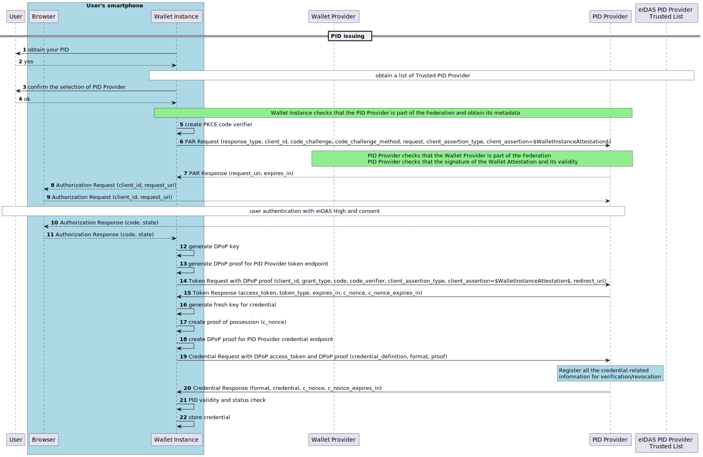

.. include:: ../common/common_definitions.rst

.. _pid_issuing.rst:

PID Issuing
+++++++++++

The relevant entities and interfaces involved in the issuing flows are:

    - *Wallet Provider*: It represents an organization (public or private) that is responsible for the release of an eIDAS-compliant EUDI Wallet solution. It also issues to the Wallet Instance a Wallet Attestation by means of an Attestation Service. The Wallet Attestation certifies the genuinity and authenticity of the Wallet Instance and its compliance with a trust framework (e.g., with respect to the relevant security and privacy requirements).
    - *Wallet Solution*: It represents the entire product and service owned by a Wallet Provider, offered to all Users of that solution. A Wallet Solution can be certified as being EUDI-compliant by a Conformity Assessment Body (CAB).
    - *Wallet Instance*: the Wallet Solution is instantiated to Wallet Instance through installation and initialization on the User's device. it provides interfaces for User interaction with the Wallet Solution backend. 
    - *PID Provider*: It represents the issuer of eIDAS Person Identification Data (PID). It is composed of:

        - OIDC VCI Component: based on the “OpenID for Verifiable Credential Issuance” specification  `[OIDC4VCI. Draft 13] <https://openid.bitbucket.io/connect/openid-4-verifiable-credential-issuance-1_0.html>`_ to release PID credentials.
        - National eID component (OIDC Core or SAML2): It represents the component to authenticate the End-User with the National IdPs.
    - National IdP: It represents preexisting identity systems based on SAML2 or OIDC, already in production in each Member State (for Italy SPID and CIE id authentication schemed notified eIDAS with *LoA* **High**).
    
.. _fig_High-Level-Flow-EUDIW-PID-Issuing:
.. figure:: ../../images/High-Level-Flow-EUDIW-PID-Issuing.svg
    :figwidth: 100%
    :align: center

    PID Issuing - General architecture and high level flow

The :numref:`fig_High-Level-Flow-EUDIW-PID-Issuing` shows a general architecture and highlights the main operations involved in the issuing of a PID, in particular:

    0. **Wallet Instance Setup**: the first time the Wallet Instance is started a preliminary setup phase MUST be carried out. It consists of the release of a verifiable proof issued by the Attestation Service provided by the Wallet Provider that asserts the genuineness, the authenticity and the compliance with a trust framework of the Wallet Instance. The verifiable proof binds a public key corresponding to a local private key generated by the Wallet Instance. 
    1. **Obtaining the trusted PID Provider**: the Wallet Instance queries the Trust Anchor to fetch the trusted PID Provider. 
    2. **Obtaining of PID Provider metadata**: the Wallet Instance fetches the Entity Statement of the PID Provider from the Trust Anchor and can establish the trust and obtain the Metadata that discloses the types of PIDs, their formats, the algorithms supported, and any other parameter required for interoperability needs.
    3. **PID request**: following the Authorization Code Flow in `[OIDC4VCI. Draft 13] <https://openid.bitbucket.io/connect/openid-4-verifiable-credential-issuance-1_0.html>`_ the Wallet Instance requests a PID to the PID Provider. A fresh key pairs is generated by the Wallet Instance and the public key is used to bind the PID
    4. **End-user authentication**: the PID Provider authenticates the End-User using a traditional eIDAS high LoA SAML2/OIDC authentication acting as an IAM Proxy. 
    5. **PID issuance**: finally, after the End-User authentication with LoA High and consent, and the check of the Wallet Instance by means of the Wallet Attestation and the Trust Chain related to the Wallet Provider as the provider of a compliant Wallet Solution, the PID Provider responds with a PID, bound to key material as requested.

The Wallet Instance Setup phase is described in Section [...]. In the following Section the steps from 1 to 5 are further expanded into more technical detailed steps. 

Detailed Flow
-------------

The PID Issuing phase is based on the **Authorization Code Flow** with **Pushed Authorization Requests** (PAR) [:rfc:`9126`] and **PKCE** (Proof Key for Code Exchange, :rfc:`7636`) as recommended in `[OIDC4VCI. Draft 13. Section 3.4] <https://openid.bitbucket.io/connect/openid-4-verifiable-credential-issuance-1_0.html#section-3.4>`_. A *Wallet Initiated Flow* is considered and the User receives the PID directly in response to the Credential Request (*Immediate Flow*) on the same device as the device the Wallet Instance resides on (*Same-device*). 

.. _fig_Low-Level-Flow-EUDIW-PID-Issuing:
3f45AtWabbGbnfZLAi68EPBR0wnMndIm_03n5lnMB3au-HXwa8cmr8lk5ax8nWJd1S4VbRjR2Bpxzh1vNfknnaAZAk1tCAdcPlhMKxbgBJ-eKkdTZi81f4PWRB0KyawhvrKcghxA-vSBTT9NsNn-UFxyPRt-tLoa3MMDvGihjvKaC8k56FhaL2lT_OfwQ9EwTTMK00d30SLMLcpk7VeuGEq7jAB4l_sorbOg1BL5Ey8mOaWngWBN0RdrZh6GKuiBK8EYdx8XT59GjKZLHLdt7RWzNlvVg8dQAyn6_GRw9pajAbIN3IyWO4L1mojYe3EjPSQGS8FevV7g_H3ObDSd4MH9pEzl80-Q5jjPqBCWBrCUIDyIzEiyJ7jd9GRKofmuimdfhKWOZhQXYkG4sIiPWkNuJW7_YiWf7Ztlqdcqj-Su4QwpjyZGDoRQXAOtWSqyjJWjHzJ8KxrMKJbuxqXg6FRrWVPrQgNqZXMIDK6ZLyZrfsbI8xx2iyVkDL0sjNjq_HCWt3_v9tZ1q__UjS5h-3iVvhiZ_WKTgCdMaxhDXZtTpFBP1-jaca1VJQCzBSe2bAGjaj0FcTpvCjoa1CTeoXAPYsHHEGldjVHxhUyqkhhF9NLUAf-gast-i_XZFlhNUcOb9w_DZymfyHp_UgYPpZdPB5XYZfXZhcVjP3TZPif_iBA08TbC-MO-fEDYtpr-NPilk2SMFTLqGUfSRncmiO8L6783jVQQcaWlEGxrpm6FVfplV1NFRw0TPwIJI-qp1qpBd5QYVzV8mwz3XcFn8VTdFgfQF3J_0W00

    PID Issuing - Detailed flow

**Steps 1-4:** The User has selected a PID Provider, and the Wallet Instance obtains the metadata for the selected PID Provider.

.. note::

    **Federation Check:** The Wallet Instance needs to check if the PID Provider is part of Federation and then it can consume its Metadata.

**Steps 5-6:** The Wallet Instance creates a fresh PKCE code verifier and sends this along in a *pushed authorization request* using the OIDC request parameter (see :rfc:`9126` Section 3) to the pushed authorization endpoint of the PID Provider. The Wallet Instance signs this request using its attested private key. We assume that a standard OAuth2 client authentication method should be involved as the pushed authorization endpoint is a protected endpoint. The client authentication can be based on the model defined in [:rfc:`7521`] using the Wallet Instance Attestation JWS inside the client_assertion parameter. The authorization_details [RAR :rfc:`9396`] parameter is extended to allow Wallet Instance to specify types of the credentials when requesting authorization for PID issuance.

The following is a non-normative example of the PAR.

.. code-block::

    POST /as/par HTTP/1.1
    Host: pid.it
    Content-Type: application/x-www-form-urlencoded
    
    response_type=code
    &client_id=$thumprint-of-the-jwk-in-the-cnf-wallet-attestation$
    &code_challenge=E9Melhoa2OwvFrEMTJguCHaoeK1t8URWbuGJSstw-cM
    &code_challenge_method=S256
    &request=eyJhbGciOiJSUzI1NiIsImtpZCI6ImsyYmRjIn0.ew0KIC Jpc3MiOiAiczZCaGRSa3F0MyIsDQogImF1ZCI6ICJodHRwczovL3NlcnZlci5leGFtcGxlLmNvbSIsDQo gInJlc3BvbnNlX3R5cGUiOiAiY29kZSBpZF90b2tlbiIsDQogImNsaWVudF9pZCI6ICJzNkJoZFJrcXQz IiwNCiAicmVkaXJlY3RfdXJpIjogImh0dHBzOi8vY2xpZW50LmV4YW1...
    &client_assertion_type=urn:ietf:params:oauth:client-assertion-type:jwt-bearer
    &client_assertion=$WalletInstanceAttestation$ 

The JWT payload of PAR is given as the following:

.. code-block:: JSON

    {
    "response_type":"code",
    "client_id":$thumprint-of-the-jwk-in-the-cnf-wallet-attestation$,
    "state":"fyZiOL9Lf2CeKuNT2JzxiLRDink0uPcd",
    "code_challenge":"E9Melhoa2OwvFrEMTJguCHaoeK1t8URWbuGJSstw-cM",
    "code_challenge_method":"S256",
    "authorization_details":[
    {
        "type":"openid_credential",
        "format": "vc+sd-jwt",
        "credential_definition": {
            "type": ["eu.eudiw.pid.it"]
        }
    }
    ],
    "redirect_uri":"eudiw://start.wallet.it",
    "client_assertion_type":"urn:ietf:params:oauth:client-assertion-type:jwt-bearer",
    "client_assertion":$WalletInstanceAttestation$ 
    }

.. note::
    **Federation Check:** PID Provider needs to check that the Wallet Provider is part of the federation and in addition it should verify Wallet Instance Attestation validity by checking its signature and the validity of the claims inside it. 

**Step 7:** The PID Provider creates a new request URI representing this new authorization request and returns it to the Wallet Instance. 

.. code-block:: 

    HTTP/1.1 201 Created
    Content-Type: application/json
    Cache-Control: no-cache, no-store
    
    {
        "request_uri":"urn:example:bwc4JK-ESC0w8acc191e-Y1LTC2",
        "expires_in": 60
    }

**Steps 8-9:** The Wallet Instance sends an authorization request to the PID Provider authorization endpoint.

.. code-block:: 

    GET /authorize?client_id=$thumprint-of-the-jwk-in-the-cnf-wallet-attestation$
        &request_uri=urn%3Aexample%3Abwc4JK-ESC0w8acc191e-Y1LTC2 HTTP/1.1
    Host: pid.it
 

.. note::

   **User Authentication and Consent:** The PID Provider performs the User authentication based on the requirements of eIDAS LoA High and asks the User for consent for the PID issuance. 

**Steps 10-11:** The PID Provider sends an authorization code to the Wallet Instance. 

.. note::

    The Wallet Instance redirect URI is a universal or app link registered with the local operating system, so this latter will resolve it and pass the response to the Wallet Instance.
 
.. code-block:: 

    HTTP/1.1 302 Found
    Location: eudiw://start.wallet.it?code=SplxlOBeZQQYbYS6WxSbIA
 
**Steps 12-13:** The Wallet Instance creates a key for DPoP and a fresh DPoP proof for the token request to the PID Provider. DPoP provides a way to bind the access token to a certain sender (Wallet Instance) `[DPoP-draft16] <https://datatracker.ietf.org/doc/html/draft-ietf-oauth-dpop-16>`_. Thus, it mitigates the misuse of leaked or stolen access tokens at the credential endpoint of PID Provider as the attacker needs to present a valid DPoP proof.

**Step 14:** The Wallet Instance sends a token request to the PID Provider's token endpoint using the authorization *code*, *code_verifier* and *DPoP proof*, and *Wallet Instance Attestation*. The *Wallet Instance Attestation* is used to perform the Wallet Instance authentication at the token endpoint as it is defined in [:rfc:`7521`]. 

.. code-block::

    POST /token HTTP/1.1
    Host: pid.it
    Content-Type: application/x-www-form-urlencoded
    DPoP: eyJ0eXAiOiJkcG9wK2p3dCIsImFsZyI6IkVTMjU2IiwiandrIjp7Imt0eSI6Ik
        VDIiwieCI6Imw4dEZyaHgtMzR0VjNoUklDUkRZOXpDa0RscEJoRjQyVVFVZldWQVdCR
        nMiLCJ5IjoiOVZFNGpmX09rX282NHpiVFRsY3VOSmFqSG10NnY5VERWclUwQ2R2R1JE
        QSIsImNydiI6IlAtMjU2In19.eyJqdGkiOiItQndDM0VTYzZhY2MybFRjIiwiaHRtIj
        oiUE9TVCIsImh0dSI6Imh0dHBzOi8vc2VydmVyLmV4YW1wbGUuY29tL3Rva2VuIiwia
        WF0IjoxNTYyMjYyNjE2fQ.2-GxA6T8lP4vfrg8v-FdWP0A0zdrj8igiMLvqRMUvwnQg
        4PtFLbdLXiOSsX0x7NVY-FNyJK70nfbV37xRZT3Lg

    client_id=$thumprint-of-the-jwk-in-the-cnf-wallet-attestation$
    &grant_type=authorization_code
    &code=SplxlOBeZQQYbYS6WxSbIA
    &redirect_uri=eudiw://start.wallet.it
    &code_verifier=dBjftJeZ4CVP-mB92K27uhbUJU1p1r_wW1gFWFOEjXk
    &client_assertion_type=urn:ietf:params:oauth:client-assertion-type:jwt-bearer
    &client_assertion=$WalletInstanceAttestation$

**Step 15:** The PID Provider validates the request and if it is successful, it issues an *access token* (bound to the DPoP key) and a fresh *c_nonce*.  

.. code-block::

    HTTP/1.1 200 OK
    Content-Type: application/json
    Cache-Control: no-store
    
    {
    "access_token": "Kz~8mXK1EalYznwH-LC-1fBAo.4Ljp~zsPE_NeO.gxU",
    "token_type": "DPoP",
    "expires_in": 2677,
    "c_nonce": "tZign[...]snFbp",
    "c_nonce_expires_in": 86400
    }

**Steps 16-18:** The Wallet Instance creates a fresh key pair the new credential shall be bound to.  Then, it creates a proof of possession with the new key and the *c_nonce* obtained in **Step 15** and it creates a DPoP proof for the request to the PID credential issuance endpoint.  

**Step 19:** The Wallet Instance sends a PID issuance request to the PID Provider credential endpoint. It contains the *access token*, the *DPoP proof*, the *credential type*, the *proof* (proof of possession of the key) and the *format*.

.. note::

    **PID Credential Schema and Status registration:**  The PID Provider MUST register all the PID credential related information for the later status verification and revocation. 

.. code-block::

    POST /credential HTTP/1.1
    Host: pid.it
    Content-Type: application/x-www-form-urlencoded
    DPoP: eyJ0eXAiOiJkcG9wK2p3dCIsImFsZyI6IkVTMjU2IiwiandrIjp7Imt0eSI6Ik
        VDIiwieCI6Imw4dEZyaHgtMzR0VjNoUklDUkRZOXpDa0RscEJoRjQyVVFVZldWQVdCR
        nMiLCJ5IjoiOVZFNGpmX09rX282NHpiVFRsY3VOSmFqSG10NnY5VERWclUwQ2R2R
        1JEQSIsImNydiI6IlAtMjU2In19.eyJqdGkiOiJlMWozVl9iS2ljOC1MQUVCIiwiaHRtIj
        oiR0VUIiwiaHR1IjoiaHR0cHM6Ly9yZXNvdXJjZS5leGFtcGxlLm9yZy9wcm90ZWN0Z
        WRyZXNvdXJjZSIsImlhdCI6MTU2MjI2MjYxOCwiYXRoIjoiZlVIeU8ycjJaM0RaNTNF
        c05yV0JiMHhXWG9hTnk1OUlpS0NBcWtzbVFFbyJ9.2oW9RP35yRqzhrtNP86L-Ey71E
        OptxRimPPToA1plemAgR6pxHF8y6-yqyVnmcw6Fy1dqd-jfxSYoMxhAJpLjA
    
    credential_definition=%7B%22type%22:%5B%22eu.eudiw.pid.it%22%5D%7D
    &format=vc+sd-jwt
    &proof=%7B%22type%22:%22...-ace0-9c5210e16c32%22%7D

A non-normative example of proof parameter is given below:

.. code-block:: JSON

    {
    "proof_type": "jwt",
    "jwt": "eyJraWQiOiJkaWQ6ZXhhbXBsZTplYm …"
    }

Where the JWT looks like this:

.. code-block:: JSON

    {
    "alg": "ES256",
    "typ": "JWT",
    "jwk": … 
    }
    .
    {
    "iss": "0b434530-e151-4c40-98b7-74c75a5ef760",
    "aud": "https://pid.issuer.it",
    "iat": "1504699136",
    "nonce": "tZignsnFbp"
    }

**Steps 20-22:** The PID Provider checks the *DPoP proof* and whether the *access token* is valid and suitable for the requested PID. It also checks the proof of possession for the key material the new credential shall be bound to. If all checks succeed, the PID Provider creates a new credential bound to the key material and sends it to the Wallet Instance. The Wallet Instance MUST perform the PID integrity and authenticity checks and if it is successful can proceed with secure storage of the PID credential. 

.. code-block::

    HTTP/1.1 200 OK
    Content-Type: application/json
    Cache-Control: no-store
    Pragma: no-cache
    
    {
    "format": "vc+sd-jwt"
    "credential" : "LUpixVCWJk0eOt4CXQe1NXK[...]WZwmhmn9OQp6YxX0a2L",
    "c_nonce": "fGFF7[...]UkhLa",
    "c_nonce_expires_in": 86400
    }

PAR endpoint
------------

Authorization endpoint
----------------------

Token endpoint
--------------

Credential endpoint
-------------------