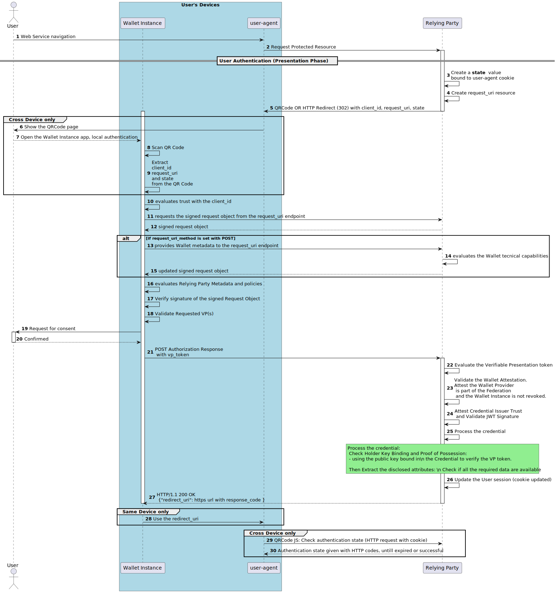

.. include:: ../common/common_definitions.rst

.. _Wallet Instance Attestation: wallet-instance-attestation.html
.. _Trust Model: trust.html

.. _relying-party-solution:

Relying Party Solution
+++++++++++++++++++++++

This section describes how a Relying Party may ask to a Wallet Instance the presentation of the PID and the (Q)EAAs, according the following specifications: 

- `OpenID for Verifiable Presentations - draft 19 <https://openid.net/specs/openid-4-verifiable-presentations-1_0.html>`_.
- `Draft: OAuth 2.0 Demonstrating Proof-of-Possession at the Application Layer (DPoP) <https://datatracker.ietf.org/doc/html/draft-ietf-oauth-dpop>`_.

In this section the following flows are described:

- **Remote Same Device Flow**, where the user-agent and the Wallet Instance are used in the same device.
- **Remote Cross Device Flow**, where the user-agent and the Wallet Instance are used in different devices.

In the **Same Device** and **Cross Device** Flows described in this chapter, the User interacts with a remote Relying Party.

Remote Protocol Flow
--------------------

In this scenario the Relying Party provides the URL where the signed presentation request object is available for download.

Depending on whether the Relying Party client is on a mobile device or a workstation, it must activate one of the supported remote flows:

* **Same Device**, the Relying Party MUST provide a HTTP redirect (302) location to the Wallet Instance;
* **Cross Device**, the Relying Party MUST provide a QR Code which the User frames with their Wallet Instance.

Once the Wallet Instance establishes the trust with the Relying Party, the User gives the consent for the release of the personal data, in the form of a Verifiable Presentation.

Below a sequence diagram that summarizes the interactions between all the involved parties.

FE8C9kYG736_KWWTb3OkS08GSmHZ_YkW3LCu6504bdNWRdI2MYmj8Xk0oXYKQUZC7mx1owEcxV5LBxl48BYuO5q4rF61IqE3R0rSEwInpMAV-pa7TgqzcU7pi0m6EZybR98V1mjOw26jV5D7l4xf2yHoT0jTApgXY_8_nbPK8zsEudKuhUb0gH_vW-EFvnoDOgx24iDnbeVpMLfd09FQjiAsnDMCBPsDD6gn_ApDOepTjHkC89akxpjIjWfgCf7hGxNe4zpMQVFkk0u3NzGbeAxW6lfDkjeOIEX7S42aarkxm-ZKuajSbz65yzsJcpguw9BbY16-JTtCzxR3tipzHf1hCDlruEaZfsLDu6GBwKdI2SB9VsGg2VK733jU-3I6_FFHDKwyrIg9xCg0yf7O6Ey-0Nv2EynDqnuqyc2gACJQ0muRUbYU4JFa2RBYE9A4V8tZDPqgheD2VaR2s3Bifs2zuoMwdVsV6OEgY3nta6pertxo3_8Q1Inxu5iMraed-o-CK9cfXU8WEzwzRNIZXMpNqHmKGjthdre6m9atVDkLnsrvNrioLMw7iMuhRybVta-dUAFewCL9DorWqzNCfwk6QNlVINDmhFjC8EqkX4Emr0esk98pY6kwyZ-XACjjQ7qvIZuNwHg3t-MNHKJ7cZAKesw0Z6EtSkvlRwStu-lftTZXYnE1gYU85RgsM5FGLD_1P6Ka5p48eYlgH_YhhFOMJ8mevXUW9aRdgEDDAm0i5bgsbJ6d3liLWeIdTaLFLpiePOp2bVkr6DrrAvOMs7YNm49oQnO1-H1LfTQevK3zt2qiv0gR-0kuGUCELfXBaKS-fOBsSFTIoBLRPvQqV69RD2Z7VooFOJaVUc3zyEFi07y_FuVuhoVXduCe2pPjoC89b2BM7w7Jf6TSsqRD8A-_VVlUjtqzNsQ0JliAT1RfkDpV9B7BxBoPh_xTx6-os_fV9gCtSxYu57vAAOJBujlgBWVPtfYIXwBWy5BfG3PeIaacINty2aN1K87ojSssi0nz5whnvr5dx9_eNL_e_

The details of each step shown in the previous picture are described in the table below.

.. list-table::
  :widths: 50 50
  :header-rows: 1

  * - **Id**
    - **Description**
  * - **1**, **2**
    - The User asks for access to a protected resource, the Relying Party redirects the User to a discovery page in which the User selects the *Login with the Wallet* button. The Authorization flow starts.
  * - **3**, **4**, **5**
    - The Relying Party creates an Authorization Request which contains the scopes of the request and sends it back.
  * - **6**, **7**, **8**, **9**
    - In the **Cross Device Flow**: the Request URI is provided in the form of a QR Code that is shown to the User that frames it. The Wallet Instance decodes the QR Code and extracts the Request URI from the QR Code payload. In the **Same Device Flow** the Relying Party responses with the Request URI in the form of HTTP Redirect Location (302). 
  * - **10**
    - The Wallet Instance requests the content of the Authorization Request by invoking the Request URI, passing an Authorization DPoP HTTP Header containing the Wallet Instance Attestation and the DPoP proof HTTP Header.
  * - **11**
    - The Relying Party attests the trust to the Wallet Instance using the Wallet Instance Attestation and verifies its capabilities.
  * - **12**
    - The Relying Party issues a signed Request Object, returning it as response.
  * - **13**, **14**, **15**, **16**
    - The Wallet Instance verifies Request Object JWS. The Wallet Instance attests the trust to the Relying Party by verifying the ``trust_chain``. The Wallet Instance verifies the signature of the request and processes the Relying Party metadata to attest its capabilities and allowed scopes, attesting which Verifiable Credentials and personal attributes the Relying Party is granted to request.
  * - **17**, **18**
    - The Wallet Instance requests the User's consent for the release of the credentials. The User authorizes and consents the presentation of their credentials, by selecting/deselecting the personal data to release.
  * - **19**
    - The Wallet Instance provides the Authorization Response to the Relying Party using a HTTP method POST (response Mode "direct_post").
  * - **20**, **21**, **22**
    - The Relying Party verifies the Authorization Response, extracts the Credential and attests the trust to the credentials Issuer. The Relying Party verifies the revocation status and the proof of possession of the presented credential.
  * - **23**
    - The Relying Party authenticates the User and updates its session.
  * - **24**
    - The Relying Party notifies the Wallet Instance that the operation ends successfully.

Authorization Request Details
-----------------------------

The Relying Party creates a signed request object, then gives it to the Wallet Instance through a HTTP URL (request URI) that points to the resource where the signed request object MUST be available for download. The URL parameters contained in the Relying Party response, containing the request URI, are described in the Table below.

.. list-table::
  :widths: 25 50
  :header-rows: 1

  * - **Name**
    - **Description**
  * - **client_id**
    - Unique identifier of the Relying Party.
  * - **request_uri**
    - The HTTP URL used by the Wallet Instance to retrieve the signed request object from the Relying Party. The URL is intentionally extended with a random value that uniquely identifies the transaction.

Below a non-normative example of the response containing the required parameters previously described.

.. code-block:: javascript

  eudiw://authorize?client_id=`$client_id`&request_uri=`$request_uri`

The value corresponding to the `request_uri` endpoint MUST be randomized, according to `RFC 9101, The OAuth 2.0 Authorization Framework: JWT-Secured Authorization Request (JAR) <https://www.rfc-editor.org/rfc/rfc9101.html#section-5.2.1>`_ Section 5.2.1.

In the **Same Device Flow** the Relying Party uses a HTTP response redirect (status code 302) as represented in the following non-normative example:

.. code:: text

    HTTP/1.1 /pre-authz-endpoint Found
    Location: https://wallet-providers.eudi.wallet.gov.it?
    client_id=https%3A%2F%2Frelying-party.example.org%2Fcb
    &request_uri=https%3A%2F%2Frelying-party.example.org%2Frequest_uri%3Fid%3Drandom-value

In the **Cross Device Flow**, a QR Code is shown by the Relying Party to the User in order to issue the Authorization Request. The User frames the QR Code using their Wallet Instance. The QR Code payload MUST be a **Base64 encoded string**.

Below is represented a non-normative example of a QR Code issued by the Relying Party.

Below is represented a non-normative example of the QR Code raw payload:

.. code-block:: text

  ZXVkaXc6Ly9hdXRob3JpemU/Y2xpZW50X2lkPWh0dHBzOi8vdmVyaWZpZXIuZXhhbXBsZS5vcmcmcmVxdWVzdF91cmk9aHR0cHM6Ly92ZXJpZmllci5leGFtcGxlLm9yZy9yZXF1ZXN0X3VyaS8=

The decoded content of the previous Base64 value is represented below:

.. code-block:: text

  eudiw://authorize?client_id=https%3A%2F%2Frelying-party.example.org&request_uri=https%3A%2F%2Frelying-party.example.org%2Frequest_uri%3Fid%3Drandom-value

.. note::
    The *error correction level* chosen for the QR Code MUST be Q (Quartily - up to 25%), since it offers a good balance between error correction capability and data density/space. This level of quality and error correction allows the QR Code to remain readable even if it is damaged or partially obscured.

Cross Device Flow Status Checks and Security
--------------------------------------------

When the flow is Cross Device, the user-agent needs to check the session status to the endpoint made available by Relying Party (status endpoint). This check MAY be implemented in the form of JavaScript code, within the page that shows the QRCode, then the user-agent checks the status with a polling strategy in seconds or a push strategy (eg: web socket).

Since the QRcode page and the status endpoint are implemented by the Relying Party, it is under its responsability the implementation details of this solution, since it is related to the Relying Party's internal API.

The Relying Party MUST bind the request of the user-agent, with a Secure and HttpOnly session cookie, with the issued request. The request url SHOULD include a parameter with a random value. The HTTP response returned by this specialized endpoint MAY contain the HTTP status codes listed below:

* **200 OK**. The signed request object was issued by the Relying Party that waits to be downloaded by the Wallet Instance at the **request_uri** endpoint.
* **202 Accepted**. This response is given when the signed request object was obtained by the Wallet Instance.
* **302 Found**. The Wallet Instance has sent the presentation to the Relying Party's  **redirect_uri** endpoint and the User authentication is successful. The Relying Party updates the session cookie allowing the user-agent to access to the protected resource. The ``Location`` within the HTTP Response allows the user-agent to leave the QRCode page.
* **401 Unauthorized**. The Wallet Instance or its User have rejected the request, or the request is expired. The QRCode page SHOULD be updated with an error message.

Below a non-normative example of the HTTP Request to this specialized endpoint, where the parameter ``id`` contains an opaque and random value:

.. code::

  GET /session-state?id=3be39b69-6ac1-41aa-921b-3e6c07ddcb03
  HTTP/1.1
  HOST: relying-party.example.org

Request Object Details
----------------------
The following actions are made by the Wallet Instance:

- scan the QR Code (Cross Device only);
- extract from the payload the ``request_uri`` parameter;
- invoke the retrieved URI;
- provide in the request its Wallet Instance Attestation, using `DPOP`_ to proof the legitimate possession of it;
- obtain the signed request object from the Relying Party.

Below a non-normative example of HTTP request made by the Wallet Instance to the Relying Party to provide the Wallet Instance Attestion and retrieve the signed request object:

.. code-block:: javascript

  GET /request_uri HTTP/1.1
  HOST: relying-party.example.org
  Authorization: DPoP $WalletInstanceAttestation
  DPoP: $WalletInstanceAttestationProofOfPossession

More detailed information about the `Wallet Instance Attestation`_ is available in its dedicated section of this technical specification.

To attest a high level of security, the Wallet Instance submits its Wallet Instance Attestation to the Relying Party, disclosing its capabilities and the security level attested by its Wallet Provider.

Herein the description of the parameters defined in *OAuth 2.0 Demonstration of Proof-of-Possession at the Application Layer (DPoP)*.

.. note::
    The use of DPoP doesn't represent any breaking changes to Wallet Instances that do not support DPoP to a *request_uri* endpoint, since it is assumed to use it as an additional security mechanisms for the attestation of the status of the Wallet Instance.

    If the DPoP HTTP Header is missing, the Relying Party would assume the lowest attestable level of security to the Wallet Instance it is interacting with.

DPoP HTTP Header
^^^^^^^^^^^^^^^^

A **DPoP proof** is included in the request using the HTTP Header ``DPoP`` and containing a JWS. The JWS MUST be signed with the public key made available in the Wallet Instance Attestation (``Authorization: DPoP``).

The JOSE header of the **DPoP JWS** MUST contain at least the following parameters:

.. list-table:: 
    :widths: 20 60 20
    :header-rows: 1

    * - **JOSE header**
      - **Description**
      - **Reference**
    * - **typ** 
      - It MUST be equal to ``dpop+jwt``. 
      - [:rfc:`7515`] and [:rfc:`8725`. Section 3.11].
    * - **alg** 
      - A digital signature algorithm identifier such as per IANA "JSON Web Signature and Encryption Algorithms" registry. It MUST be one of the supported algorithms in Section *Cryptographic Algorithms* <supported_algs>`* and MUST NOT be none or an identifier for a symmetric algorithm (MAC).
      - [:rfc:`7515`]
    * - **jwk** 
      - Representing the public key chosen by the client, in JSON Web Key (JWK) [RFC7517] format, as defined in Section 4.1.3 of [RFC7515]. It MUST NOT contain a private key.
      - [:rfc:`7517`] and [:rfc:`7515`]

The payload of a **DPoP proof** MUST contain at least the following claims:

.. list-table:: 
    :widths: 20 60 20
    :header-rows: 1

    * - **Claim**
      - **Description**
      - **Reference**
    * - **jti**
      - Unique identifier for the DPoP proof JWT. The value MUST be assigned in a *UUID v4* string format according to [:rfc:`4122`].
      - [:rfc:`7519`. Section 4.1.7].
    * - **htm**
      - The value of the HTTP method of the request to which the JWT is attached.
      - [:rfc:`9110`. Section 9.1].
    * - **htu**
      - The HTTP target URI, without query and fragment parts, of the request to which the JWS is attached.
      - [:rfc:`9110`. Section 7.1].
    * - **iat**
      - UNIX Timestamp with the time of JWT issuance, coded as NumericDate as indicated in :rfc:`7519`. 
      - [:rfc:`7519`. Section 4.1.6].
    * - **ath**
      - Hash of the Wallet Instance Attestation. 
      - [`DPOP`_. Section 4.2].

Therein a non-normative example of the DPoP decoded content:

.. code-block:: text

    {
      "typ": "dpop+jwt",
      "alg": "ES256",
      "jwk": {
        "kty": "EC",
        "x": "l8tFrhx-34tV3hRICRDY9zCkDlpBhF42UQUfWVAWBFs",
        "y": "9VE4jf_Ok_o64zbTTlcuNJajHmt6v9TDVrU0CdvGRDA",
        "crv": "P-256"
      }
    }
    .
    {
      "jti": "f47c96a1-f928-4768-aa30-ef32dc78aa69",
      "htm": "GET",
      "htu": "https://relying-party.example.org/request_uri",
      "iat": 1562262616,
      "ath": "fUHyO2r2Z3DZ53EsNrWBb0xWXoaNy59IiKCAqksmQEo"
    }

Request URI response
--------------------

The Relying Party issues a signed request object, where a non-normative example in the form of decoded header and payload is shown below:

.. code-block:: text

  {
    "alg": "ES256",
    "typ": "JWT",
    "kid": "e0bbf2f1-8c3a-4eab-a8ac-2e8f34db8a47",
    "trust_chain": [
      "MIICajCCAdOgAwIBAgIC...awz",
      "MIICajCCAdOgAwIBAgIC...2w3",
      "MIICajCCAdOgAwIBAgIC...sf2"
    ]
  }
  .
  {
    "scope": "eu.europa.ec.eudiw.pid.it.1 pid-sd-jwt:unique_id+given_name+family_name",
    "client_id_scheme": "entity_id",
    "client_id": "https://relying-party.example.org",
    "response_mode": "direct_post.jwt",
    "response_type": "vp_token",
    "response_uri": "https://relying-party.example.org/callback",
    "nonce": "2c128e4d-fc91-4cd3-86b8-18bdea0988cb",
    "state": "3be39b69-6ac1-41aa-921b-3e6c07ddcb03",
    "iss": "https://relying-party.example.org",
    "iat": 1672418465,
    "exp": 1672422065
  }

The JWS header parameters are described herein:

.. list-table::
  :widths: 25 50
  :header-rows: 1

  * - **Name**
    - **Description**
  * - **alg**
    - Algorithm used to sign the JWT, according to [:rfc:`7516#section-4.1.1`]. It MUST be one of the supported algorithms in Section *Cryptographic Algorithms* and MUST NOT be none or an identifier for a symmetric algorithm (MAC).
  * - **typ**
    - Media Type of the JWT, as defined in [:rfc:`7519`].
  * - **kid**
    - Key ID of the public key needed to verify the JWS signature, as defined in [:rfc:`7517`]. Required if ``trust_chain`` is used.
  * - **trust_chain**
    - Sequence of Entity Statements that composes a Trust Chain related to the Relying Party, as defined in `OIDC-FED`_ Section *3.2.1. Trust Chain Header Parameter*.

The JWS payload parameters are described herein:

.. list-table::
  :widths: 25 50
  :header-rows: 1

  * - **Name**
    - **Description**
  * - **scope**
    - Aliases for well-defined Presentation Definitions IDs. It will be used to identify which required credentials and User attributes are requested by the Relying Party.
  * - **client_id_scheme**
    - String identifying the scheme of the value in the ``client_id``. It MUST be ``entity_id``.
  * - **client_id**
    - Unique Identifier of the Relying Party.
  * - **response_mode**
    - Used to ask the Wallet Instance in which way it has to send the response. It MUST be ``direct_post.jwt``.
  * - **response_type**
    - The supported response type, MUST be set to``vp_token``.
  * - **response_uri**
    - The Response URI to which the Wallet Instance MUST send the Authorization Response using an HTTPs POST.
  * - **nonce**
    - Fresh cryptographically random number with sufficient entropy used for security reason, which length MUST be at least 32 digits.
  * - **state**
    - Unique identifier of the Authorization Request.
  * - **iss**
    - The entity that issued the JWT. It will be populated with the Relying Party URI.
  * - **iat**
    - The NumericDate representing the time at which the JWT was issued.
  * - **exp**
    - The NumericDate representing the expiration time on or after which the JWT MUST NOT be accepted for processing.

.. warning::

    The usage of ``scope`` instead of ``presentation_definition`` is still under discussion and needs better refinements.

Here a non-normative example of ``presentation_definition``:

.. code-block:: JSON

  {
    "presentation_definition": {
      "id": "presentation definitions",
      "input_descriptors": [
        {
          "id": "pid-sd-jwt:unique_id+given_name+family_name",
          "name": "Person Identification Data",
          "purpose": "User authentication",
          "format": "vc+sd-jwt",
          "constraints": {
            "fields": [
              {
                "path": [
                  "$.credentialSubject.unique_id",
                  "$.credentialSubject.given_name",
                  "$.credentialSubject.family_name",
                ]
              }
            ],
            "limit_discolusre": "preferred"
          }
        }
      ]
    }
  }

  

.. note::

  The following parameters, even if defined in [OID4VP], are not mentioned in the previous non-normative example, since their usage is conditional and may change in future release of this documentation.

  - ``presentation_definition``: JSON object according to `Presentation Exchange <https://identity.foundation/presentation-exchange/spec/v2.0.0/>`_. This parameter MUST not be present when ``presentation_definition_uri`` or ``scope`` are present.
  - ``presentation_definition_uri``: string containing an HTTPS URL pointing to a resource where a Presentation Definition JSON object can be retrieved. This parameter MUST be present when ``presentation_definition`` parameter or a ``scope`` value representing a Presentation Definition is not present.
  - ``client_metadata``: A JSON object containing the Relying Party metadata values. The ``client_metadata`` parameter MUST NOT be present when ``client_id_scheme`` is ``entity_id``. The ``client_metadata`` is taken from ``trust_chain``.
  - ``client_metadata_uri``: string containing an HTTPS URL pointing to a resource where a JSON object with the Relying Party metadata can be retrieved. The ``client_metadata_uri`` parameter MUST NOT be present when ``client_id_scheme`` is ``entity_id``.
  - ``redirect_uri``: the redirect URI to which the Wallet Instance MUST redirect the Authorization Response. This parameter MUST not be present when ``response_uri`` is present.

Authorization Response Details
------------------------------
After getting the User authorization and consent for the presentation of the credentials, the Wallet sends the Authorization Response to the Relying Party ``response_uri`` endpoint, the content should be encrypted according `OPENID4VP`_ Section 6.3, using the Relying Party public key.

.. note::
    **Why the response is encrypted?**

    The response sent from the Wallet Instance to the Relying Party is encrypted to prevent a malicious agent from gaining access to the plaintext information transmitted within the Relying Party's network. This is only possible if the network environment of the Relying Party employs `TLS termination <https://www.f5.com/glossary/ssl-termination>`_. Such technique employs a termination proxy that acts as an intermediary between the client and the webserver and handles all TLS-related operations. In this manner, the proxy deciphers the transmission's content and either forwards it in plaintext or by negotiates an internal TLS session with the actual webserver's intended target. In the first scenario, any malicious actor within the network segment could intercept the transmitted data and obtain sensitive information, such as an unencrypted response, by sniffing the transmitted data.

Below a non-normative example of the request:

.. code-block:: http

  POST /callback HTTP/1.1
  HOST: relying-party.example.org
  Content-Type: application/x-www-form-urlencoded
  
  response=eyJhbGciOiJFUzI1NiIs...9t2LQ
  

Below is a non-normative example of the decrypted JSON ``response`` content:

.. code-block:: JSON

  {
    "state": "3be39b69-6ac1-41aa-921b-3e6c07ddcb03",
    "vp_token": "eyJhbGciOiJFUzI1NiIs...PT0iXX0",
    "presentation_submission": {
        "definition_id": "32f54163-7166-48f1-93d8-ff217bdb0653",
        "id": "04a98be3-7fb0-4cf5-af9a-31579c8b0e7d",
        "descriptor_map": [
            {
                "id": "pid-sd-jwt:unique_id+given_name+family_name",
                "path": "$.vp_token.verified_claims.claims._sd[0]",
                "format": "vc+sd-jwt"
            }
        ]
    }
  }

Where the following parameters are used:

.. list-table::
  :widths: 25 50
  :header-rows: 1

  * - **Name**
    - **Description**
  * - **vp_token**
    - JWS containing a single (or an array) of Verifiable Presentation(s) in the form of JWS.
  * - **presentation_submission**
    - JSON Object contains mappings between the requested Verifiable Credentials and where to find them within the returned VP Token.
  * - **state**
    - Unique identifier provided by the Relying Party within the Authorization Request.

Below is a non-normative example of the ``vp_token`` decoded content, represented in the form of JWS header and payload, separated by a period:

.. code-block:: text

   {
     "alg": "ES256",
     "typ": "JWT",
     "kid": "e0bbf2f1-8c3a-4eab-a8ac-2e8f34db8a47"
   }
   .
   {
    "iss": "https://wallet-provider.example.org/instance/vbeXJksM45xphtANnCiG6mCyuU4jfGNzopGuKvogg9c",
    "jti": "3978344f-8596-4c3a-a978-8fcaba3903c5",
    "aud": "https://relying-party.example.org/callback",
    "iat": 1541493724,
    "exp": 1573029723,
    "nonce": "2c128e4d-fc91-4cd3-86b8-18bdea0988cb"
    "vp": "<Issuer-Signed-JWT>~<Disclosure 1>~<Disclosure 2>~...~<Disclosure N>"
   }

Where the following parameters are used:

.. list-table::
  :widths: 25 50
  :header-rows: 1

  * - **Name**
    - **Description**
  * - **vp**
    - The digital credential in its original state. The public key contained in the digital credential MUST be used to verify the entire VP JWS as Proof of Possession of the private key which the public part is carried in the digital credential (Holder Key Binding).
  * - **jti**
    - JWS Unique identifier.
  * - **iat**
    - Unix timestamp of the issuance datetime.
  * - **exp**
    - Unix timestamp beyond which the presentation of the digital credential will no longer be considered valid.
  * - **aud**
    - Audience of the VP, corresponding to the ``redirect_uri`` within the Authorization request issued by the Relying Party.
  * - **nonce**
    - Nonce provided by the Relying Party within the Authorization Request.

Relying Party Entity Configuration
---------------------------------------------
According to the `Trust Model`_ section, the Relying Party is a Federation Entity and MUST expose a .well-known endpoint containing its Entity Configuration. 

Below a non-normative example of the request made by the Wallet Instance to the *openid-federation* .well-known endpoint to obtain the Relying Party Entity Configuration:

.. code-block:: http

  GET /.well-known/openid-federation HTTP/1.1
  HOST: relying-party.example.org

Below is a non-normative response example:

.. code-block:: text

    {
        "alg": "RS256",
        "kid": "2HnoFS3YnC9tjiCaivhWLVUJ3AxwGGz_98uRFaqMEEs",
        "typ": "entity-statement+jwt"
    }
    .
    {
        "exp": 1649590602,
        "iat": 1649417862,
        "iss": "https://rp.example.it",
        "sub": "https://rp.example.it",
        "jwks": {
            "keys": [
                {
                    "kty": "RSA",
                    "n": "5s4qi …",
                    "e": "AQAB",
                    "kid": "2HnoFS3YnC9tjiCaivhWLVUJ3AxwGGz_98uRFaqMEEs"
                }
            ]
        },
        "metadata": {
            "wallet_relying_party": {
                "application_type": "web",
                "client_id": "https://rp.example.it",
                "client_name": "Name of an example organization",
                "jwks": {
                    "keys": [
                        {
                            "kty": "RSA",
                            "use": "sig",
                            "n": "1Ta-sE …",
                            "e": "AQAB",
                            "kid": "YhNFS3YnC9tjiCaivhWLVUJ3AxwGGz_98uRFaqMEEs",
                            "x5c": [ "..." ]
                        }
                    ]
                },
                
                "contacts": [
                    "ops@relying-party.example.org"
                ],
                
                "request_uris": [
                    "https://relying-party.example.org/request_uri"
                ],
                "redirect_uris": [
                    "https://relying-party.example.org/callback"
                ],
                
                "default_acr_values": [
                    "https://www.spid.gov.it/SpidL2",
                    "https://www.spid.gov.it/SpidL3"
                ],
    
                  "vp_formats": {
                     "jwt_vp_json": {
                        "alg": [
                           "EdDSA",
                           "ES256K"
                        ]
                     }
                  },
                  "presentation_definitions": [
                      {
                        "id": "pid-sd-jwt:unique_id+given_name+family_name",
                        "input_descriptors": [
                            {
                                "id": "sd-jwt",
                                "format": {
                                    "jwt": {
                                        "alg": [
                                            "EdDSA",
                                            "ES256"
                                        ]
                                    },
                                    "constraints": {
                                        "limit_disclosure": "required",
                                        "fields": [
                                            {
                                                "path": [
                                                    "$.sd-jwt.type"
                                                ],
                                                "filter": {
                                                    "type": "string",
                                                    "const": "PersonIdentificationData"
                                                }
                                            },
                                            {
                                                "path": [
                                                    "$.sd-jwt.cnf"
                                                ],
                                                "filter": {
                                                    "type": "object",
                                                }
                                            },
                                            {
                                                "path": [
                                                    "$.sd-jwt.family_name"
                                                ],
                                                "intent_to_retain": "true"
                                            },
                                            {
                                                "path": [
                                                    "$.sd-jwt.given_name"
                                                ],
                                                "intent_to_retain": "true"
                                            },
                                            {
                                                "path": [
                                                    "$.sd-jwt.unique_id"
                                                ],
                                                "intent_to_retain": "true"
                                            }
                                        ]
                                    }
                                }
                            }
                        ]
                      },
                      {
                        "id": "mDL-sample-req",
                        "input_descriptors": [
                            {
                                "id": "mDL",
                                "format": {
                                    "mso_mdoc": {
                                        "alg": [
                                            "EdDSA",
                                            "ES256"
                                        ]
                                    },
                                    "constraints": {
                                        "limit_disclosure": "required",
                                        "fields": [
                                            {
                                                "path": [
                                                    "$.mdoc.doctype"
                                                ],
                                                "filter": {
                                                    "type": "string",
                                                    "const": "org.iso.18013.5.1.mDL"
                                                }
                                            },
                                            {
                                                "path": [
                                                    "$.mdoc.namespace"
                                                ],
                                                "filter": {
                                                    "type": "string",
                                                    "const": "org.iso.18013.5.1"
                                                }
                                            },
                                            {
                                                "path": [
                                                    "$.mdoc.family_name"
                                                ],
                                                "intent_to_retain": "false"
                                            },
                                            {
                                                "path": [
                                                    "$.mdoc.portrait"
                                                ],
                                                "intent_to_retain": "false"
                                            },
                                            {
                                                "path": [
                                                    "$.mdoc.driving_privileges"
                                                ],
                                                "intent_to_retain": "false"
                                            }
                                        ]
                                    }
                                }
                            }
                        ]
                    }
                ],

                "default_max_age": 1111,
                
                // JARM related
                "authorization_signed_response_alg": [[
                    "RS256",
                    "ES256"
                ],
                "authorization_encrypted_response_alg": [
                    "RSA-OAEP",
                    "RSA-OAEP-256"
                ],
                "authorization_encrypted_response_enc": [
                    "A128CBC-HS256",
                    "A192CBC-HS384",
                    "A256CBC-HS512",
                    "A128GCM",
                    "A192GCM",
                    "A256GCM"
                ],

                // SIOPv2 related
                "subject_type": "pairwise",
                "require_auth_time": true,
                "id_token_signed_response_alg": [
                    "RS256",
                    "ES256"
                ],
                "id_token_encrypted_response_alg": [
                    "RSA-OAEP",
                    "RSA-OAEP-256"
                ],
                "id_token_encrypted_response_enc": [
                    "A128CBC-HS256",
                    "A192CBC-HS384",
                    "A256CBC-HS512",
                    "A128GCM",
                    "A192GCM",
                    "A256GCM"
                ],
            },
            "federation_entity": {
                "organization_name": "OpenID Wallet Relying Party example",
                "homepage_uri": "https://relying-party.example.org/home",
                "policy_uri": "https://relying-party.example.org/policy",
                "logo_uri": "https://relying-party.example.org/static/logo.svg",
                "contacts": [
                   "tech@relying-party.example.org"
                 ]
            }
        },
        "authority_hints": [
            "https://registry.eudi-wallet.example.it"
        ]
      }
    }
    

The Entity Configuration is a JWS, where its header parameters are defined below: 

.. list-table::
  :widths: 25 50
  :header-rows: 1

  * - **Name**
    - **Description**
  * - **alg**
    - Algorithm used to sign the JWT
  * - **typ**
    - Media Type of the JWT
  * - **kid**
    - Key ID used identifying the key used to sign the JWS

While each metadata specific parameter is defined below:

.. list-table::
  :widths: 25 50 25
  :header-rows: 1

  * - **Name**
    - **Description**
    - **Specs**
  * - TBD
    - TBD
    - TBD

