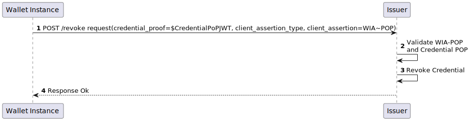

.. include:: ../common/common_definitions.rst

.. _sec_revocation_intro:

Credential Lifecycle
++++++++++++++++++++

The value of a Digital Credential is conditional on its validity. A Credential that has been revoked, due to legal requirements, inaccuracy or compromise, is valueless and potentially harmful. 
For these reasons a robust mechanism for managing the life-cycle and the revocation of a Digital Credential is required.

This section outlines the key technical requirements and processes related to the revocation of Digital Credentials. 
Furthermore, it provides the technical details that the Verifiers MUST implement to verify, in a secure and reliable manner, the validity of a Digital Credential during the presentation phase.

The verification of the validity of a Digital Credential is based on the `OAUTH-STATUS-ASSERTION`_ draft 02.

A Status Assertion is a signed document serving as proof of a Digital Credential's current validity status. The Credential Issuer provides these assertions to Holders who can present them to Verifiers together with the corresponding Digital Credentials. 

The Status Assertions have the following features:

- automated issuance, as the User authentication is not required for the provisioning of the Status Assertion; 
- verification of the Digital Credential validity status in both online and offline scenarios;
- privacy-preserving, according to the following evidences:

  1. the Verifier cannot check over time the validity of a given  Digital Credential related to the User;
  2. the Credential Issuers cannot track when and where a Digital Credential is verified;
  3. it doesn't reveal any information about the Users or the content of their Digital Credentials.

.. _sec_revocation_assumption:

Operational Requirements
------------------------

- **Internet Connection for Status Assertions**: Status Assertions can be obtained only when the Wallet Instance is connected to the internet and actively operated by the User. 
- **Role of a Credential Issuer**: A Credential Issuer is responsible for creating and issuing Credentials, as well as managing their lifecycle and validity status.
- **Involvement of Authentic Sources**: When one or more Authentic Sources are involved in the issuance of a Digital Credential, the information exchanged between the Authentic Source and the Credential Issuer is crucial for the Digital Credential's issuance. Furthermore, in cases where the Authentic Source initiates a revocation or data changes, revoking the Digital Credential becomes necessary.

.. _sec_revocation_requirements:

Functional Requirements
-----------------------

In addition to the requirements in Section 5 of `OAUTH-STATUS-ASSERTION`_ draft 02, **The Status Assertion:**

- MUST have a validity period not greater than 24 hours;
- MUST NOT reveal any information about the Relying Party, the User's device or the User's data contained in the Digital Credential the assertion is related to;
- MUST be non-repudiable even beyond its expiration time and even in the case of cryptographic keys rotation.

**The Credential Issuer MUST:**

- ensure that the data contained in a Digital Credential is kept up to date, including the status of validity of the data from the Authentic Source;
- revoke a Digital Credential when the following circumstances occur:

  - the Digital Credential requires to be updated, whenever one or more attributes are changed; in this case the User will request a new issuance for that Digital Credential;
  - the Holder needs to address the loss or compromise of cryptographic key material associated with the issued Digital Credential. In such case, the End-User should request the revocation of the Digital Credential through a service provided by the Credential Issuer and using an authentication method that offers the same Level of Assurance obtained during the Credential Issuance;
  - the User deletes the Digital Credential from the Wallet Instance. The Wallet Instance therefore should request the revocation of such Digital Credential to the Credential Issuer;

- provide a web service for allowing a Wallet Instance, with a proof of possession of a specific Digital Credential, to 

  - request a revocation of that Digital Credential;
  - obtain a related Status Assertion;

- provide out-of-band mechanisms through which the User can request the revocation of their Digital Credentials, using a robust procedure for identity proofing and User authentication, in particular when the User is unable to use the personal Wallet Instance. 

**The Wallet Instance MUST:**

- check periodically the validity status of the Digital Credential that is stored in it, requesting a Status Assertion for each Digital Credential;
- be able to present a Status Assertion if required by a Verifier, along with the corresponding Digital Credential;
- request a revocation of a Digital Credential when the Users delete it from the storage. 

**The Authentic Sources MUST:**

- provide web services for the providing of updated User data and the validity status;
- store in local databases only the minimum information required to provide the Credential Issuer with the User data or a change in the validity status.

Revocation Use Cases
--------------------

The revocation of a Digital Credential MAY be triggered by: 

- Users using their personal Wallet Instance or by some out-of-band touchpoints.
- Revocation of the Wallet Instance.
- Authentic Sources (e.g., for attribute updates) following administrative purposes. 
- Law-Enforcing Bodies for the fulfillment of their functions and any other judicial reasons (e.g., Police).

Credential Revocation Flows can start under different scenarios, such as:

    - The User reports the loss or theft of their own physical document to the Law-Enforcement Authorities: this implies that the Credentials, if any, shall be revoked.
    - The User notifies an Authentic Source that one or more attributes are changed (e.g. the current resident address): in this case the Credentials MUST be revoked, as they are no longer valid due to the change in attributes. 
    - Users who lose access to their Wallet Instance (e.g., due to theft or loss of the device) can request the Credential Issuer to revoke their Credentials or ask the Wallet Provider to revoke the Wallet Instance. If the Wallet Provider is authorized by the User and is aware of the types of Credentials and their issuers stored in the Wallet, it can then initiate the revocation of all Digital Credentials contained within the Wallet Instance on behalf of the User.
    - The Law-Enforcing Authorities, for the fulfillment of their functions and any other judicial reasons, may request the Authentic Source to revoke entitlements, licenses, certificates, identification documents, etc., which in turn leads to the revocation of any linked Credentials.
    - The Authentic Sources that for any update of one or more User attributes, SHOULD inform the Credential Issuer that has previously requested those data for the issuance of a Credential about that User. 
    - The Credential Issuers, for technical security reasons (e.g. in the case of compromised cryptographic keys), SHOULD decide to revoke the Credentials.

The revocation scenarios involve two main flows:

    - The **Revocation flows**: these flows describe how an Entity requests for a Digital Credential revocation. 
    - The **Status Assertion flows**: these flows define the technical protocols for requesting and obtaining a Status Assertion and how the Wallet Instance SHOULD provide it to a Verifier as a proof of validity of a corresponding Digital Credential.

.. _sec_revocation_high_level_flow:

Revocation Flows
----------------

Depending on the different scenarios that may involve the revocation of a Digital Credential, different processes and technical flows may be implemented, according to national laws or Regulations of specific domains.
The subsequent sections define the protocol interface between the Wallet Instances and the Credential Issuers during the revocation request. The communication between the Credential Issuers and other Entities is out-of-scope of this technical implementation profile.

.. _sec_revocation_wi_initiated_flow:

Revocation Request by Wallet Instance
^^^^^^^^^^^^^^^^^^^^^^^^^^^^^^^^^^^^^

A Wallet Instance MUST request the revocation of a Digital Credential as defined below.

.. _fig_Low-Level-Flow-Revocation:
aepj-Xy0
    
    Wallet Instance Initiated Revocation Flow

**Step 1 (Credential Revocation Request)**: The Wallet Instance initiates the process by creating a Credential Revocation Request. This request MUST be sent to the Credential Issuer who has previously issued that Credential. The Credential Revocation Request MUST contain a JSON object with the member `revocation_requests`.

The `revocation_requests` MUST be set with an array of strings, where each string within the array represents a Credential Revocation Request object, enabling the Wallet Instance to request multiple Credential Revocation Requests to a single Credential Issuer.

The request MUST be signed with the private key related to the public key contained within the Credential (such as the Credential Issuer Signed JWT in the case of SD-JWT, or the MSO in the case of Mdoc CBOR). Then, the Wallet Instance sends the request to the Credential Issuer as in the following non-normative example representing a Revocation Assertion Request array.

.. _credential_revocation_request_ex:
.. code-block::
    
    POST /revoke HTTP/1.1
    Host: pid-provider.example.org
    Content-Type: application/json
    
    revocation_requests : ["${base64url(json({typ: (some pop for revocation-assertion)+jwt, ...}))}.payload.signature", ... ]
   
 
Below, is given a non-normative example of a single Revocation Assertion Request object with decoded JWT headers and payload and without signature for better readability:

.. _credential_pop_jwt_ex:
.. code-block::

    {
      "alg": "ES256",
      "typ": "credential-revocation-request+jwt",
      "kid": $CREDENTIAL-CNF-JWKID
    }
    .
    {
      "iss": "0b434530-e151-4c40-98b7-74c75a5ef760",
      "aud": "https://pid-provider.example.org/revoke",
      "iat": 1698744039,
      "exp": 1698744139, 
      "jti": "6f204f7e-e453-4dfd-814e-9d155319408c",
      "credential_hash": $Issuer-Signed-JWT-Hash,
      "credential_hash_alg": "sha-256",
    }

**Step 2 (PoP verification)**: The Credential Issuer verifies the proof of possession of the Credential requested to be revoked, using the the confirmation method that was attested in the Credential. If the verification is successful the revocation request is allowed.

**Step 3 (Credential Revocation)**: The Credential Issuer revokes the Credential provided in the Revocation Request object. After the revocation, the Credential Issuer MAY also send a notification to the User (e.g. using a User's email address, telephone number, or any other verified and secure communication channel), with all needed information related to the Credential revocation status update. This communication is out of scope of the current technical implementation profile. 

**Step 4 (Credential Revocation Response)**: The Credential Issuer sends a response back to the Wallet Instance with the result of the revocation request.

.. code::

    .. code-block:: http
		HTTP/1.1 200 Ok
		Content-Type: application/json

		{
			"revocation_assertion_responses": ["${base64url(json({typ: revocation_assertion+jwt, ...}))}.payload.signature", ... ]
		}
 
Credential Revocation HTTP Request
~~~~~~~~~~~~~~~~~~~~~~~~~~~~~~~~~~

The requests to the *Credential Issuer Revocation endpoint* MUST be HTTP with method POST, using the mandatory parameters listed below within the HTTP request message body. These MUST be encoded in ``application/json`` format.

.. _table_revocation_request_params: 
.. list-table:: 
    :widths: 20 60 20
    :header-rows: 1

    * - **Claim**
      - **Description**
      - **Reference**
    * - **revocation_requests**
      - It MUST be an array of strings, where each represents a Revocation Assertion Request object. Each element MUST contain a signed JWT as a cryptographic proof of possession to which the Digital Credential to be revoked shall be bound. See Section :ref:`Credential Proof of Possession <sec_revocation_credential_pop>`_ for more details.
      - `OAUTH-STATUS-ASSERTION`_ draft 02.

The Revocation Endpoint MUST be provided by the Credential Issuer within its Metadata. 

Credential Revocation HTTP Response
~~~~~~~~~~~~~~~~~~~~~~~~~~~~~~~~~~~

The *Credential Issuer* MUST return an HTTP response with the status code set to 200 and the `status_assertion_responses` array with the related Revocation Assertion object. The status code 200 MUST be returned if the Revocation Assertion is requested for a valid, non-existent, expired, already revoked or invalid Digital Credential.

The response MUST:

- include a JSON object with a member named `revocation_assertion_responses`;

- be encoded in ``application/json`` format. 

Otherwise, an HTTP error response MUST be provided by the Credential Issuer using status codes according to the table below. 

The following HTTP Status Codes MUST be supported:

.. list-table:: 
    :widths: 20 20 60
    :header-rows: 1

    * - **Status Code**
      - **Body**
      - **Description**
    * - *200 Created*
      - Revocation Assertion Response
      - The Revocation Assertion Response has been successfully created.
    * - *400 Bad Request*
      - Error code and description
      - The Credential Issuer cannot fulfill the request because of invalid parameters.
    * - *500 Internal Server Error*
      - 
      - The Credential Issuer encountered an internal problem. (:rfc:`6749#section-5.2`).
    * - *503 Service Unavailable*
      - 
      - The Credential Issuer is temporary unavailable. (:rfc:`6749#section-5.2`).

The ``revocation_assertion_responses`` object MUST contain the following mandatory claims.

.. _table_http_response_claim:
.. list-table:: 
    :widths: 20 60 20
    :header-rows: 1

    * - **Claim**
      - **Description**
      - **Reference**
    * - **revocation_assertion_responses**
      - the Revocation Assertions and or the Revocation Assertion Errors related to the request made by the Wallet Instance. 
      - `OAUTH-STATUS-ASSERTION`_ draft 02`_.

The Revocation Assertion object MUST contain the parameter ``credential_status_validity`` with the value set to ``false``.
Below a non-normative example of a Revocation Assertion object in JWT format, with the headers and payload represented in JSON and without applying the signature.

.. code::

  {
    "alg": "ES256",
    "typ": "revocation-error+jwt",
    "kid": "Issuer-JWK-KID"
  }
 .
  {
    "iss": "https://issuer.example.org",
    "jti": "6f204f7e-e453-4dfd-814e-9d155319408c"
    "credential_hash": $CREDENTIAL-HASH,
    "credential_hash_alg": "sha-256",
    "credential_status_validity": false,
    "cnf": {
      "jwk": {
        "alg": "ES256",
        "kty": "EC",
        "crv": "P-256",
        "x": "_2ySUmWFjwmraNlo15r6dIBXerVdy_NpJuwAKJMFdoc",
        "y": "MV3C88MhhEMba6oyMBWuGeB3dKHP4YADJmGyJwwILsk"
      }
    }
  }

The Revocation Assertion Error object MUST contain the following parameters:

  - *error*. The error code, as registerd in the table below;
  - *error_description*. Text in human-readable form providing further details to clarify the nature of the error encountered.

Errors are meant to provide additional information about the failure so that the User can be informed and take the appropriate action.
The `error` parameter for the Revocation Assertion Error object MUST be set with one of the values defined in the table below, in addition to the values specified in :rfc:`6749#section-5.2`:

.. list-table::
    :widths: 20 80
    :header-rows: 1

    * - **Error Code**
      - **Description**
    * - ``invalid_request``
      - The request is not valid due to the lack or incorrectness of one or more parameters. (:rfc:`6749#section-5.2`).
    * - ``credential_already_revoked``
      - The Digital Credential is already revoked.
    * - ``credential_updated``
      - One or more information contained in the Digital Credential are changed. The `error_description` field SHOULD contain a human-readable text describing the general parameters updated without specifying each one.
    * - ``credential_invalid``
      - The Digital Credential is invalid. The `error_description` field SHOULD contain the reason of invalidation.
    * - ``invalid_request_signature``
      - The Revocation Assertion Request signature validation has failed. This error type is used when the proof of possession of the Digital Credential is found not valid within the Revocation Assertion Request.
    * - ``credential_not_found``
      - The `credential_hash` value provided in the Revocation Assertion Request doesn't match with any active Digital Credential.
    * - ``unsupported_hash_alg``
      - The hash algorithm set in `credential_hash_alg` is not supported.

Below a non-normative example of a Revocation Assertion Error object in JWT format, with the headers and payload represented in JSON and without applying the signature.

.. code::

  {
    "alg": "ES256",
    "typ": "revocation-assertion-error+jwt",
    "kid": "Issuer-JWK-KID"
  }
  .
  {
    "iss": "https://issuer.example.org",
    "jti": "6f204f7e-e453-4dfd-814e-9d155319408c"
    "credential_hash": $CREDENTIAL-HASH,
    "credential_hash_alg": "sha-256",
    "error": "unsupported_hash_alg",
    "error_description": "The hash algorithm is not supported"
  }

Status Assertion Flows
------------------------

The Status Assertion process is divided into the following phases:

  1. The Status Assertion Request by a Wallet Instance: it involves the Wallet Instance and the Credential Issuer.
  2. The Status Assertion Presentation to a Verifier: it involves the Wallet Instance and the Verifier.

.. figure:: ../../images/High-Level-Flow-Status-Attestation.svg
    :figwidth: 100%
    :align: center
    
    High-Level Status Assertion Flows

.. _sec_revocation_status_assertion_request:

Status Assertion Request by Wallet Instance
^^^^^^^^^^^^^^^^^^^^^^^^^^^^^^^^^^^^^^^^^^^^^

The presentation of a Credential to a Verifier may occur long after it has been issued by the Credential Issuer. During this time interval, the Credential can be invalidated for any reason and therefore the Verifier also needs to verify its revocation or suspension status. To address this scenario, the Credential Issuer provides the Wallet Instance with a *Status Assertion*. This Assertion is bound to a Credential so that the Wallet Instance can present it to a Verifier, along with the Credential itself, as proof of non-revocation status of the Credential.

The following diagram shows how the Wallet Instance requests a Status Assertion to the Credential Issuer.

.. _fig_Low-Level-Flow-Status-Assertion:
.. figure:: ../../images/Low-Level-Flow-Revocation-Attestation.svg
    :figwidth: 100%
    :align: center
    :target: https://www.plantuml.com/plantuml/svg/NP31Rk9038RlynGMsWD8mDwHTWM22tlOHWML2r8rIHmoQZ9EnnuGRryFeK0vsl_tErzcpcA3nBOnDWhvsEOOJAShLxZEUe71pZOD2gozahx00LY6a_l9h9aZXalqb2oYrEXrXWt5SArRDkRaOF8Nt0oobyqMVkjnYGm1FoEo38k0PQhPvhsZxi-lvMtEAFktsuwC-Uw_sSQLLX3k32W4IXdZIGCwOW0tjZo3ROtGomBbOfrdg0Are9Bmh0fxdzQnIzTBi2B1vL5G_NrvQHpJfvsSeRVN0bKfIFS2nKEj952K2LMJF9LQB6hh7RTZPOSuFKoLJE3bNBRwlu95jcRWCmks8xZ_vRB6uWCg2WyUUz-x9P-RoqCbO0etoKtPXGWcJqU-Vnlb53mf-OhSaMVKGUfh0PxvEVeojiqN
    
    Status Assertion Request Flow

**Step 1 (Status Assertion Request)**: The Wallet Instance sends the Status Assertion Request to the Credential Issuer, where:

- The request MUST contain the base64url encoded hash value of the Digital Credential, for which the Status Assertion is requested, and enveloped in a signed Status Assertion Request object.

- The Status Assertion Request object MUST be signed with the private key corresponding to the confirmation claim assigned by the Issuer and contained within the Digital Credential.

Below a non-normative example representing a Status Assertion Request array with a single Status Assertion Request object in JWT format.

.. code::

    POST /status HTTP/1.1
    Host: issuer.example.org
    Content-Type: application/json

	{
		"status_assertion_requests" : ["${base64url(json({typ: (some pop for status-assertion)+jwt, ...}))}.payload.signature", ... ]
	}

The Status Assertion HTTP request can be sent to a single Credential Issuer regarding multiple Digital Credentials, and MUST contain a JSON object with the member `status_assertion_requests`.
The `status_assertion_requests` MUST be set with an array of strings, where each string within the array represents a Digital Credential Status Assertion Request object.

A non-normative example of Credential Proof of Possession is provided :ref:`in the previous section <credential_pop_jwt_ex>`.

**Step 2 (PoP verification)**: The Credential Issuer that receives the Status Assertion Request object MUST validate that the Wallet Instance making the request is authorized to request Status Assertions. Therefore the following requirements MUST be satisfied:

- The Credential Issuer MUST verify the compliance of all elements in the `status_assertion_requests` object using the confirmation method contained within the Digital Credential where the Status Assertion Request object is referred to;

- The Credential Issuer MUST verify that it is the legitimate Issuer of the Digital Credential to which each Status Assertion Request object refers.

**Step 3 (Check for validity)**: The Credential Issuer checks that the User's attributes are not updated by the Authentic Source or that the latter has not revoked them. The technical mechanisms for obtaining this information are out-of-scope of this technical implementation profile. 

**Step 4 (Status Assertion Creation)**: The Credential Issuer creates the corresponding Status Assertion. When a Status Assertion is requested to a Credential Issuer, the Credential Issuer checks the status of the Digital Credential and creates a Status Assertion bound to it. If the Digital Credential is valid, the Credential Issuer creates a new Status Assertion, which a non-normative example is given below where the format is JWT.

.. code::

    {
    "alg": "ES256",
    "typ": "status-assertion+jwt",
    "kid": $ISSUER-JWKID
	}
	.
	{
		"iss": "https://issuer.example.org",
		"iat": 1504699136,
		"exp": 1504785536,
		"credential_hash": $CREDENTIAL-HASH,
		"credential_hash_alg": "sha-256",
		"credential_status_validity": true,
		"cnf": {
			"jwk": {...}
		}
	}

**Step 4 (Status Assertion Response)**: The response MUST include a JSON object with a member named `status_assertion_responses`, which contains the Status Assertions and or the Status Assertion Errors related to the request made by the Wallet Instance, as in the following non-normative example.

.. code::

    HTTP/1.1 200 Created
	Content-Type: application/json

	{
		"status_assertion_responses": ["${base64url(json({typ: status-assertion+jwt, ...}))}.payload.signature", ... ]
	}

The member `status_assertion_responses` MUST be an array of strings, where each of them represent a Status Assertion Response object as defined in `OAUTH-STATUS-ASSERTION`_ draft 02`_.

Status Assertion HTTP Request
~~~~~~~~~~~~~~~~~~~~~~~~~~~~~~~

The requests to the *Credential status endpoint* of the Credential Issuers MUST be HTTP with method POST, using the same mandatory parameters as in the :ref:`Table of Credential Request parameters <table_revocation_request_params>`. These MUST be encoded in ``application/json`` format. 

.. list-table:: 
    :widths: 20 60 20
    :header-rows: 1

    * - **Claim**
      - **Description**
      - **Reference**
    * - **status_assertion_requests**
      - It MUST be an array of strings, where each of them represent a Status Assertion Request object. Each element MUST contain a signed JWT as a cryptographic proof of possession of the Digital Credential. See Section :ref:`Credential Proof of Possession <sec_revocation_credential_pop>`_ for more details. 
      - `OAUTH-STATUS-ASSERTION`_ draft 02.

The *typ* value in the *credential_pop* JWT MUST be set to **status-assertion+jwt**

The *Credential status endpoint* MUST be provided by the Credential Issuers within their Metadata. The Credential Issuers MUST include in the issued Digital Credentials the object *status_assertion_requests* with the JSON member *status_assertion* set to a JSON Object containing the *credential_hash_alg* claim. It MUST contain the algorithm used for hashing the Digital Credential. Among the hash algorithms, the value ``sha-256`` is RECOMMENDED .

Status Assertion HTTP Response
~~~~~~~~~~~~~~~~~~~~~~~~~~~~~~~~

The *Credential Issuer* MUST return an HTTP response with the status code set to 200 and the `status_assertion_responses` array with the related Status Assertion object. The status code 200 MUST be returned if the Status Assertion is requested for a valid, non-existent, expired, revoked or invalid Digital Credential.

The response MUST:

- include a JSON object with a member named `status_assertion_responses`;

- be encoded in ``application/json`` format. 

It MUST contain the following mandatory claims.

.. _table_http_status_assertion_response_claim:
.. list-table:: 
    :widths: 20 60 20
    :header-rows: 1

    * - **Claim**
      - **Description**
      - **Reference**
    * - **status_assertion_responses**
      - the Status Assertions and or the Status Assertion Errors related to the request made by the Wallet Instance. 
      - `OAUTH-STATUS-ASSERTION`_ draft 02.

The following HTTP Status Codes MUST be supported:

.. list-table:: 
    :widths: 20 20 60
    :header-rows: 1

    * - **Status Code**
      - **Body**
      - **Description**
    * - *200 Created*
      - Status Assertion Response
      - The Status Assertion Response has been successfully created and it has been returned.  
    * - *400 Bad Request*
      - Error code and description
      - The Credential Issuer cannot fulfill the request because of invalid parameters.
    * - *404 Not Found*
      - 
      - The Digital Credential may not be found by the Issuer, or the Status Attestation cannot be issued because the Credential has been revoked or updated.
    * - *500 Internal Server Error*
      - 
      - The Credential Issuer encountered an internal problem. (:rfc:`6749#section-5.2`).
    * - *503 Service Unavailable*
      - 
      - The Credential Issuer is temporary unavailable. (:rfc:`6749#section-5.2`).

The Status Assertion Error object MUST contain the following parameters:

  - *error*. The error code, as registerd in the table below;
  - *error_description*. Text in human-readable form providing further details to clarify the nature of the error encountered.

Errors are meant to provide additional information about the failure so that the User can be informed and take the appropriate action.
The `error` parameter for the Status Assertion Error object MUST be set with one of the values defined in the table below, in addition to the values specified in :rfc:`6749#section-5.2`:

.. list-table:: 
    :widths: 20 80
    :header-rows: 1

    * - **Error Code**
      - **Description**
    * - ``invalid_request``
      - The request is not valid due to the lack or incorrectness of one or more parameters. (:rfc:`6749#section-5.2`).
    * - ``credential_revoked``
      - The Digital Credential is revoked. The reason of revocation MUST be provided in the *error_description* field.
    * - ``credential_updated``
      - One or more information contained in the Digital Credential are changed. The `error_description` field SHOULD contain a human-readable text describing the general parameters updated without specifying each one.
    * - ``credential_invalid``
      - The Digital Credential is invalid. The `error_description` field SHOULD contain the reason of invalidation.  
    * - ``invalid_request_signature``
      - The Status Assertion Request signature validation has failed. This error type is used when the proof of possession of the Digital Credential is found not valid within the Status Assertion Request.
    * - ``credential_not_found``
      - The `credential_hash` value provided in the Status Assertion Request doesn't match with any active Digital Credential.
    * - ``unsupported_hash_alg``
      - The hash algorithm set in `credential_hash_alg` is not supported.

Below a non-normative example of a Status Assertion Error object in JWT format, with the headers and payload represented in JSON and without applying the signature.

.. code::

  {
    "alg": "ES256",
    "typ": "status-assertion-error+jwt",
    "kid": "Issuer-JWK-KID"
  }
	.
  {
    "iss": "https://issuer.example.org",
    "jti": "6f204f7e-e453-4dfd-814e-9d155319408c"
    "credential_hash": $CREDENTIAL-HASH,
    "credential_hash_alg": "sha-256",
    "error": "credential_revoked",
    "error_description": "Credential is revoked."
  }

.. _sec_revocation_nra_presentation:

Status Assertion Presentation to the Verifiers
^^^^^^^^^^^^^^^^^^^^^^^^^^^^^^^^^^^^^^^^^^^^^^^^

During the presentation phase, a Verifier MAY request the Wallet Instance to provide a Non-Revocation Assertion along with the requested Credential. If a Verifier requests a Status Assertion for a requested Digital Credential, the Wallet Instance MUST provide the Status Assertions in the *vp_token* JSON array. If the Status Assertion is requested by the Verifier and the Wallet Instance is not able to provide it or it is expired or it is issued far back in time, the Verifier MAY decide to accept or reject the Credential according to its security policy.

Law-Enforcement Authorities or Third Parties authorized by national law, MAY require deferred non-revocation status verification but the definition of these protocols is currently out-of-scope for this technical implementation profile.

.. _sec_revocation_credential_pop:

Credential Proof of Possession
------------------------------

The Credential Proof of Possession (**credential_pop**) MUST be a JWT that MUST contain the parameters (Header and Payload) in the following table.

.. list-table:: 
    :widths: 20 60 20
    :header-rows: 1

    * - **Header**
      - **Description**
      - **Reference**
    * - **typ**
      - In case of revocation request it MUST be set to ``revocation-request+jwt``. In case of Status Assertion request it MUST be set to ``status-assertion-request+jwt``, according to `OAUTH-STATUS-ASSERTION`_ draft 02.
      - :rfc:`7516#section-4.1.1`.
    * - **alg**
      - A digital signature algorithm identifier such as per IANA "JSON Web Signature and Encryption Algorithms" registry. It MUST be one of the supported algorithms listed in the Section `Cryptographic Algorithms <algorithms.html>`_ and MUST NOT be set to ``none`` or any symmetric algorithm (MAC) identifier.
      - :rfc:`7516#section-4.1.1`.
    * - **kid**
      -  Unique identifier of the ``jwk`` or ``COSE_Key`` inside the ``cnf`` claim of the Credential to be revoked, as base64url-encoded JWK Thumbprint value, according to `OAUTH-STATUS-ASSERTION`_ draft 02.
      - :rfc:`7638#section_3`. 

.. list-table:: 
    :widths: 20 60 20
    :header-rows: 1

    * - **Payload**
      - **Description**
      - **Reference**
    * - **iss**
      - Thumbprint of the JWK in the ``cnf`` parameter of the Wallet Assertion.
      - :rfc:`9126` and :rfc:`7519`.
    * - **aud**
      - It MUST be set to the Credential Issuer endpoint at which the JWT is used.
      - :rfc:`9126` and :rfc:`7519`.
    * - **exp**
      - UNIX Timestamp with the expiry time of the JWT. It MUST be greater than the value set for `iat`.
      - :rfc:`9126` and :rfc:`7519`.
    * - **iat**
      - UNIX Timestamp with the time of JWT issuance.
      - :rfc:`9126` and :rfc:`7519`.
    * - **jti**
      - Unique identifier for the PoP proof JWT. The value SHOULD be set using a *UUID v4* value according to [:rfc:`4122`].
      - [:rfc:`7519`. Section 4.1.7].
    * - **credential_hash**
      - It MUST contain the hash value of a Digital Credential, derived by computing the base64url encoded hash of the Digital Credential.
      - `[OAuth Status Attestation draft 01] <https://datatracker.ietf.org/doc/draft-demarco-status-attestations/01/>`_.
    * - **credential_hash_alg**
      - It MUST contain the Algorithm used for hashing the Digital Credential. The value SHOULD be set to `S256`.
      - `[OAuth Status Attestation draft 01] <https://datatracker.ietf.org/doc/draft-demarco-status-attestations/01/>`_.

Revocation Assertion
--------------------

When the JWT format is used, the Revocation Assertion MUST contain the following claims. 

.. _table_revocation_assertion_header: 
.. list-table:: 
  :widths: 20 60 20
  :header-rows: 1

  * - **Header**
    - **Description**
    - **Reference**
  * - **alg**
    - Algorithm used to verify the cryptographic signature of the Revocation Assertion. Revocation Assertion that do not need to be signed SHOULD set the `alg` value to `none` in according with `OAUTH-STATUS-ASSERTION`_ draft 02.
    - `[OIDC4VCI. Draft 13] <https://openid.bitbucket.io/connect/openid-4-verifiable-credential-issuance-1_0.html>`_, [:rfc:`7515`], [:rfc:`7517`].
  * -  **typ** 
    - It MUST be set to `revocation-assertion-response+jwt` when JWT format is used.
    - [:rfc:`7515`], [:rfc:`7517`], `OAUTH-STATUS-ASSERTION`_ draft 02.

.. _table_revocation_assertion_claim:
.. list-table:: 
    :widths: 20 60 20
    :header-rows: 1

    * - **Payload**
      - **Description**
      - **Reference**
    * - **iss**
      - It MUST be set to the identifier of the Credential Issuer.
      - :rfc:`9126` and :rfc:`7519`.
    * - **jti**
      - Unique identifier for the JWT.
      - `[RFC7519, Section 4.1.7] <https://www.iana.org/go/rfc7800>`_.
    * - **credential_status_validity**
      - Boolean value indicating the absolute validity of the Credential linked to the Status Assertion. It MUST be set with the value `false`.
      - `[OAuth Status Attestation draft 01] <https://datatracker.ietf.org/doc/draft-demarco-status-attestations/01/>`_.
    

Status Assertion
------------------

When the JWT format is used, the Status Assertion MUST contain the following claims. 

.. _table_non_revocation_assertion_header: 
.. list-table:: 
  :widths: 20 60 20
  :header-rows: 1

  * - **Header**
    - **Description**
    - **Reference**
  * - **alg**
    - A digital signature algorithm identifier such as per IANA "JSON Web Signature and Encryption Algorithms" registry. It MUST be one of the supported algorithms in Section :ref:`Cryptographic Algorithms <supported_algs>` and MUST NOT be set to ``none`` or to a symmetric algorithm (MAC) identifier.
    - `[OIDC4VCI. Draft 13] <https://openid.bitbucket.io/connect/openid-4-verifiable-credential-issuance-1_0.html>`_, [:rfc:`7515`], [:rfc:`7517`].
  * -  **typ** 
    - It MUST be set to `status-assertion-request+jwt` when JWT format is used.
    - [:rfc:`7515`], [:rfc:`7517`], `[OAuth Status Attestation draft 01] <https://datatracker.ietf.org/doc/draft-demarco-status-attestations/01/>`_..
  * - **kid**
    -  Unique identifier of the Credential Issuer ``jwk`` as base64url-encoded JWK Thumbprint value.
    - :rfc:`7638#section_3`. 

.. _table_non_revocation_assertion_claim:
.. list-table:: 
    :widths: 20 60 20
    :header-rows: 1

    * - **Payload**
      - **Description**
      - **Reference**
    * - **iss**
      - It MUST be set to the identifier of the Credential Issuer.
      - :rfc:`9126` and :rfc:`7519`.
    * - **iat**
      - UNIX Timestamp with the time of JWT issuance.
      - :rfc:`9126` and :rfc:`7519`.
    * - **exp**
      - UNIX Timestamp with the expiry time of the JWT. It MUST be greater than the value set for `iat`.
      - :rfc:`9126` and :rfc:`7519`.
    * - **credential_hash**
      - Hash value of the Credential the Status Assertion is bound to.
      - `OAUTH-STATUS-ASSERTION`_ draft 02.
    * - **credential_hash_alg**
      - The Algorithm used for hashing the Credential to which the Status Assertion is bound. The value SHOULD be set to ``S256``.
      - `OAUTH-STATUS-ASSERTION`_ draft 02.
    * - **credential_status_validity**
      - Boolean value indicating the absolute validity of the Credential linked to the Status Assertion. It is REQUIRED and it MUST be set with the value "false" or "true".
      - `OAUTH-STATUS-ASSERTION`_ draft 02.
    * - **cnf**
      - JSON object containing confirmation methods. The sub-member contained within `cnf` member, such as `jwk` for JWT, MUST match with the one provided within the related Digital Credential. Other confirmation methods can be utilized when the referenced Digital Credential supports them, in accordance with the relevant standards.
      - `[RFC7800, Section 3.1] <https://www.iana.org/go/rfc7800>`_ and `[RFC8747, Section 3.1] <https://www.iana.org/go/rfc7800>`_.

Error Assertion
------------------

When the JWT format is used, the Revocation or Status Assertion Error MUST contain the following claims. 

.. _table_non_revocation_assertion_error_header: 
.. list-table:: 
  :widths: 20 60 20
  :header-rows: 1

  * - **Header**
    - **Description**
    - **Reference**
  * - **alg**
    - Algorithm used to verify the cryptographic signature of the Assertion Error. Assertion Error that do not need to be signed SHOULD set the `alg` value to `none` in according with `OAUTH-STATUS-ASSERTION`_ draft 02.
    - `[OIDC4VCI. Draft 13] <https://openid.bitbucket.io/connect/openid-4-verifiable-credential-issuance-1_0.html>`_, [:rfc:`7515`], [:rfc:`7517`].
  * -  **typ** 
    - It MUST be set to `status-assertion-response+jwt` or `revocation-assertion-response+jwt` when JWT format is used.
    - [:rfc:`7515`], [:rfc:`7517`], `OAUTH-STATUS-ASSERTION`_ draft 02.

.. _table_non_revocation_assertion_error_claim:
.. list-table:: 
    :widths: 20 60 20
    :header-rows: 1

    * - **Payload**
      - **Description**
      - **Reference**
    * - **iss**
      - It MUST be set to the identifier of the Credential Issuer.
      - :rfc:`9126` and :rfc:`7519`.
    * - **jti**
      - Unique identifier for the JWT.
      - `[RFC7519, Section 4.1.7] <https://www.iana.org/go/rfc7519>`_.
    * - **error**
      - Status code returned from the Credential Issuer after revocation. The value SHOULD be assigned with one of the error types defined in  {{RFC6749}}[Section 5.2]<https://tools.ietf.org/html/rfc6749#section-5.2> or defined in `OAUTH-STATUS-ASSERTION`_ draft 02. 
      - `[RFC6749, Section 5.2] <https://tools.ietf.org/html/rfc6749#section-5.2>`_, `OAUTH-STATUS-ASSERTION`_ draft 02
    * - **error_description**
      - Text that clarifies the nature of the error, such as attribute changes, revocation reasons, in relation to the `error` value.
      - `OAUTH-STATUS-ASSERTION`_ draft 02.
