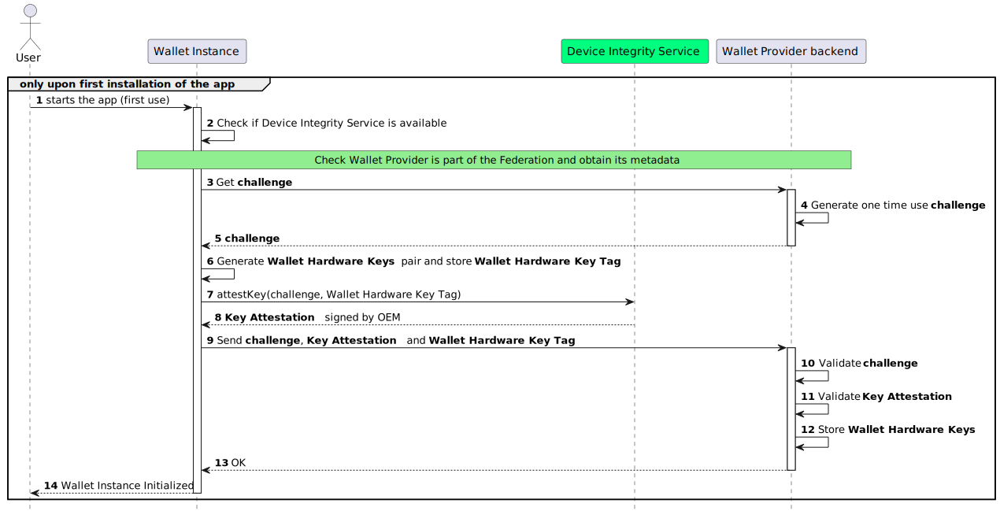
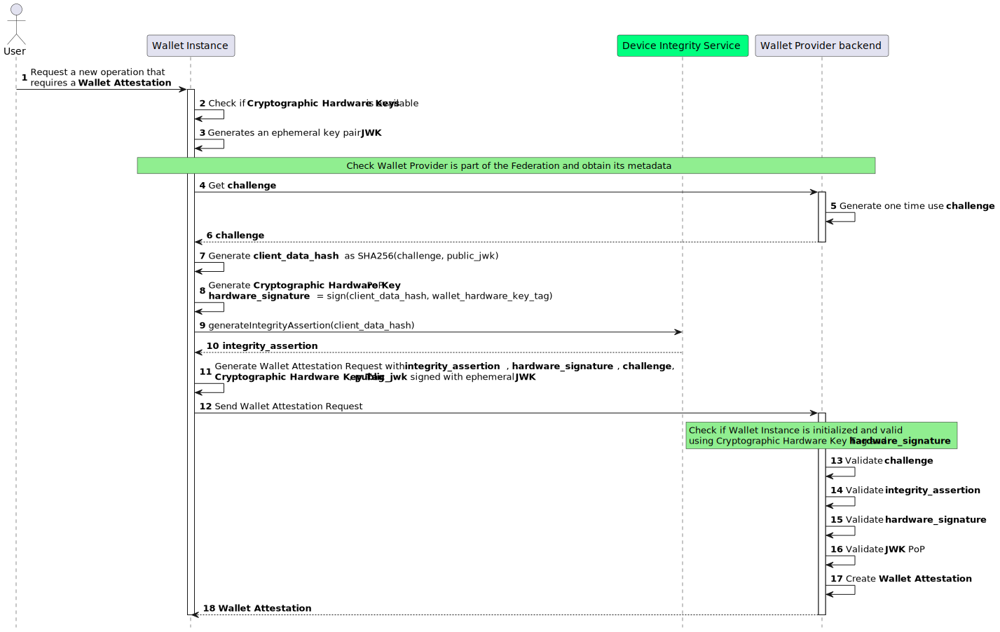

.. include:: ../common/common_definitions.rst

.. _wallet-attestation.rst:

Wallet Attestation
++++++++++++++++++

Wallet Attestation contains information regarding the security level of the device hosting the Wallet Instance. It primarily certifies the **authenticity**, **integrity**, **security**, **privacy**, and **trustworthiness** of a particular Wallet Instance. The Wallet Attestation MUST contain a Wallet Instance public key.

Requirements
------------

The following requirements for the Wallet Attestation are met:

- The Wallet Attestation MUST use the signed JSON Web Token (JWT) format;
- The Wallet Attestation MUST give all the relevant information to attests the **integrity** and **security** of the device where the Wallet Instance is installed.
- The Wallet Attestation MUST be signed by the Wallet Provider that has authority over and that is the owner of the Wallet Solution, as specified by the overseeing registration authority. This ensures that the Wallet Attestation uniquely links the Wallet Provider to this particular Wallet Instance.
- The Wallet Provider MUST ensure the integrity, authenticity, and genuineness of the Wallet Instance, preventing any attempts at manipulation or falsification by unauthorized third parties.
- The Wallet Attestation MUST have a mechanism in place for revoking the Wallet Instance, allowing the Wallet Provider to terminate service for a specific instance at any time.
- The Wallet Attestation MUST be securely bound to the Wallet Instance ephemeral public key.
- The Wallet Attestation MAY be usable multiple times during its validity period, allowing for repeated authentication and authorization without the need to request new attestations with each interaction.
- The Wallet Attestation MUST be short-lived and MUST have an expiration date time, after which SHOULD no longer be considered valid.
- The Wallet Attestation MUST NOT be issued by the Wallet Provider if the authenticity, integrity, and genuineness are not guaranteed. In this case, the Wallet Instance MUST be revoked.
- Each Wallet Instance SHOULD be able to request multiple attestations with different ephemeral public keys associated to them. This requirement provides a privacy-preserving measure, as the public key MAY be used as a tracking tool during the presentation phase (see also the point listed below).
- The Wallet Attestation MUST NOT contain any information that can be used to directly reference the User.
- The Wallet Instances MUST secure a Wallet Attestation as a prerequisite for transitioning to the Operational state, as defined by `ARF`_.
- Private keys MUST be generated and stored in the WSCD using at least one of the approaches listed below:

  - **Local Internal WSCD**: in this approach, the WSCD relies entirely on the device's native cryptographic hardware, such as the Secure Enclave on iOS devices or the Hardware Backed Keystore or Strongbox on Android devices.
  - **Local External WSCD**: the WSCD is an hardware external to the User's device, such as a smart card compliant with *GlobalPlatform* and supporting *JavaCard*.
  - **Remote WSCD**: Here, the WSCD utilizes a remote Hardware Security Module (HSM).

  - **Local Hybrid WSCD**: the WSCD involves a pluggable internal hardware component within the User's device, such as an *eUICC* that adheres to *GlobalPlatform* standards and supports *JavaCard*.
  - **Remote Hybrid WSCD**: the WSCD involves a local component mixed with a remote service.

.. warning::
  At the current stage, the current implementation profile defined in this document supports only the **Local Internal WSCD**. Future versions of this specification MAY include other approaches depending on the required `AAL`.

Static Component View
---------------------

.. figure:: ../../images/static_view_wallet_instance_attestation.svg
   :name: Wallet Solution Schema
   :alt: The image illustrates the containment of Wallet Provider and Wallet Instances within the Wallet Solution, managed by the Wallet Provider.
   :target: https://www.plantuml.com/plantuml/uml/VP8nJyCm48Lt_ugdTexOCw22OCY0GAeGOsMSerWuliY-fEg_9mrEPTAqw-VtNLxEtaJHGRh6AMs40rRlaS8AEgAB533H3-qS2Tu2zxPEWSF8TcrYv-mJzTOGNfzVnXXJ0wKCDorxydAUjMNNYMMVpug9OTrR7i22LlaesXlADPiOraToZWyBsgCsF-JhtFhyGyZJgNlbXVR1oX5R2YSoUdQYEzrQO1seLcfUeGXs_ot5_VzqYM6lQlRXMz6hsTccIbGHhGu2_hhfP1tBwHuZqdOUH6WuEmrKIeqtNonvXhq4ThY3Dc9xBNJv_rSwQeyfawhcZsTPIpKLKuFYSa_JyOPytJNk5m00

Dynamic Component View
----------------------

The Wallet Attestation acquisition flow can be divided into two main phases. The first phase involves device initialization and registration, which occurs only during the initial launch of the Wallet Instance (after installation). The second phase pertains to the actual acquisition of the Wallet Attestation.

Wallet Instance Initialization and Registration
~~~~~~~~~~~~~~~~~~~~~~~~~~~~~~~~~~~~~~~~~~~~~~~

JV2mOOaAR8wCYSes2XlGBILZBaLu_SRU5j2L4PzEuB8d6k0g1US3Qa-nvm_ZPal53dW3Vmi4R7aEo3NcDJadFfX6E90aeRdPXOiFTwlRnzMNvVAJw-N60KqY5V1a-ZtPi8-1leIGAx87DkDxKYnHqLaTtIRdUg-sPm4hqyooOflKVKLPzXmgrMRF2UX9qZXu0kKzfGf6r8JkEnWTb3HGFLLrKZNyZHmR3PLWi-K2Rb7A7oW4ztICMMPPMRfaKOEy38T7h6ndlmGrBW1LAQeTNPvCpU5bWIkNgCzfqlXj9zELR8uYLvvAo8_miFnurkZQUXx6dq_oBSn_nPY-ZczOSuawke59m7Zt0BR-PvrnUB4FznEtQOVfYrd0w4Et5rOs9x-eFASP9VqTtRNzjFlwDm00

**Step 1:**: The User starts the Wallet Instance mobile app for the first time.

**Step 2:**: The Wallet Instance:

  * check if Device Integrity Service is available.
  * check whether the device meets the minimum security requirements.

.. note::

    **Federation Check:** The Wallet Instance needs to check if the Wallet Provider is part of the Federation, obtaining its protocol specific Metadata. A non-normative example of a response from the endpoint **.well-known/openid-federation** with the **Entity Configuration** and the **Metadata** of the Wallet Provider is represented within the section `Wallet Provider metadata`_.

**Steps 3-5:**: The Wallet Instance sends a request to the Wallet Provider Backend and receives a one-time ``challenge``. This "challenge" is a ``nonce``, which must be unpredictable to serve as the main defense against replay attacks. The backend must generate the ``nonce`` value in a manner that ensures it is single-use and valid only within a specific time frame. This endpoint is compliant with the specification `OAuth 2.0 Nonce Endpoint`_.

.. code-block:: http

    GET /nonce HTTP/1.1
    Host: walletprovider.example.com

.. code-block:: http

    HTTP/1.1 200 OK
    Content-Type: application/json

    {
      "nonce": "d2JhY2NhbG91cmVqdWFuZGFt"
    }

**Step 6**: The Wallet Instance, through the operating system, creates a pair of Cryptographic Hardware Keys and stores the corresponding Cryptographic Hardware Key Tag in local storage once the following requirements are met:

   1. It MUST ensure that Cryptographic Hardware Keys do not already exist, if they exist and the Wallet is in the initialization phase they MUST be deleted.
   2. It MUST generate a pair of asymmetric Elliptic Curve keys (Cryptographic Hardware Keys) via a local WSCD.
   3. It SHOULD obtain a unique identifier (Cryptographic Hardware Key Tag) for the generated Cryptographic Hardware Keys from the operating system. If the operating system permits specifying a tag during the creation of keys, then a random string for the Cryptographic Hardware Key Tag MUST be selected. This random value MUST be collision-resistant and unpredictable to ensure security. To achieve this, consider using a cryptographic hash function or a secure random number generator provided by the operating system or a reputable cryptographic library.
   4. If the previous points are satisfied, It MUST store the Cryptographic Hardware Key Tag in a local storage.

.. note::

    **WSCD:** The Wallet Instance MAY use a local WSCD for key generation on devices that support this feature. On Android devices, Strongbox is RECOMMENDED, Trusted Execution Environment (TEE) SHOULD be used only when Strongbox is unavailable. For iOS devices, Secure Elements (SE) SHOULD be used. Given that each OEM offers a distinct SDK for accessing the local WSCD, the discussion hereafter will address this topic in a general context.

**Step 7**: The Wallet Instance uses the Device Integrity Service, providing a "challenge" and the Cryptographic Hardware Key Tag to acquire the Key Attestation.

.. note::

    **Device Integrity Service:** In this section the Device Integrity Service is considered as it is provided by device manufacturers. This service allows the verification of a key being securely stored within the device's hardware through a signed object. Additionally, it offers the verifiable proof that a specific Wallet Instance is authentic, unaltered, and in its original state using a specialized signed document made for this scope.

    The service also incorporates details in the signed object, such as the device type, model, app version, operating system version, bootloader status, and other relevant information to assess the device has not been compromised. For Android, the DIS is represented by *Key Attestation*, a feature supported by *StrongBox Keymaster*, which is a physical HSM installed directly on the motherboard, and the *TEE* (Trusted Execution Environment), a secure area of the main processor. *Key Attestation* aims to provide a way to strongly determine if a key pair is hardware-backed, what the properties of the key are, and what constraints are applied to its usage. Developers can leverage its functionality through the *Play Integrity API*.For Apple devices, the DIS is represented by *DeviceCheck*, which provides a framework and server interface to manage device-specific data securely. *DeviceCheck* is used in combination with the *Secure Enclave*, a dedicated HSM integrated into Apple's SoCs. *DeviceCheck* can be used to attest the integrity of the device, apps, and/or encryption keys generated on the device, ensuring they were created in a secure environment like *Secure Enclave*. Developers can leverage *DeviceCheck* functionality by using the framework itself.
    These services, specifically developed by the manufacturer, are integrated within the Android or iOS SDKs, eliminating the need for a predefined endpoint to access them. Additionally, as they are specifically developed for mobile architecture, they do not need to be registered as Federation Entities through national accreditation systems.
    For Apple devices *Secure Enclave* is available since the iPhone 5s (2013).
    For Android devices, the inclusion of **Strongbox Keymaster** may vary by each smartphone manufacturer, who decides whether to include it or not.

**Step 8**: The Device Integrity Service performs the following actions:

* Creates a Key Attestation that is linked with the provided "challenge" and the public key of the Wallet Hardware.
* Incorporates information pertaining to the device's security.
* Uses an OEM private key to sign the Key Attestation, therefore verifieable with the related OEM certificate, confirming that the Cryptographic Hardware Keys are securely managed by the operating system.

**Step 9**: The Wallet Instance sends the ``challenge`` with Key Attestation and Cryptographic Hardware Key Tag to the Wallet Provider Backend in order to register the Wallet Instance identified with the Cryptographic Hardware Key public key.

.. note::

  The Key Attestation (``key_attestation``) MUST be encoded in base64.

.. code-block:: http

    PUT /wallet-instance HTTP/1.1
    Host: walletprovider.example.com
    Content-Type: application/json

    {
      "challenge": "0fe3cbe0-646d-44b5-8808-917dd5391bd9",
      "key_attestation": "o2NmbXRvYXBwbGUtYXBw... redacted",
      "hardware_key_tag": "WQhyDymFKsP95iFqpzdEDWW4l7aVna2Fn4JCeWHYtbU="
    }

.. note::
  It is not necessary to send the Wallet Hardware public key because it is already included in the ``key_attestation``.

.. warning::
  During the registration phase of the Wallet Instance with the Wallet Provider it is also necessary to associate it with a specific user
  uniquely identifiable by the Wallet Provider. This association is at the discretion of the Wallet PRovider and will not be addressed
  within these guidelines as each Wallet Provider may or may not have a user identification system already implemented.

**Steps 10-12**: The Wallet Provider validates the ``challenge`` and ``key_attestation`` signature, therefore:

  1. It MUST verify that the ``challenge`` was generated by Wallet Provider and has not already been used.
  2. It MUST validate the ``key_attestation`` as defined by the device manufacturers' guidelines.
  3. It MUST verify that the device in use has no security flaws and reflects the minimum security requirements defined by the Wallet Provider.
  4. If these checks are passed, it MUST register the Wallet Instance, keeping the Cryptographic Hardware Key Tag and all useful information related to the device.
  5. It SHOULD associate the Wallet Instance with a specific User uniquely identified within the Wallet Provider's systems. This will be useful for the lifecycle of the Wallet Instance and for a future revocation.

.. code-block:: http

    HTTP/1.1 201 Created
    Content-Type: application/json

If any errors occur during the Wallet Instance registration, the Wallet Provider MUST return an error response. The response MUST use the content type set to *application/json* and MUST include the following parameters:

  - *error*. The error code.
  - *error_description*. Text in human-readable form providing further details to clarify the nature of the error encountered.

**Steps 13-14**: The Wallet Instance has been initialized and becomes operational.

.. note:: **Threat Model**: while the registration endpoint does not necessitate any client authentication, it is safeguarded through the use of `key_attestation`. Proper validation of this attestation permits the registration of authentic and unaltered app instances. Any other claims submitted will not undergo validation, leading the endpoint to respond with an error. Additionally, the inclusion of a challenge helps prevent replay attacks. The authenticity of both the challenge and the ``hardware_key_tag`` is ensured by the signature found within the ``key_attestation``.

Wallet Attestation Issuance
~~~~~~~~~~~~~~~~~~~~~~~~~~~

This section describes the Wallet Attestation format and how the Wallet Provider issues it.

zfDsFO4x-jrG442mj01NaqTXPq5Ab2VhzPOzQKkOJ5QyPo9QqA4casYOMnIA7en-Azhpah8PyBEMdVjbBQxmM9USmHNwV86Uu8QMOJ81LkuMkSAq8hD5S4asIecjBL1TqboF5Sne2JMoLzwlZpVQttZhXC2rvAE4gHg4ms_NbrSFbtSN5z_DYv1X9DerHWRkMOqIVA5yxHjj3YuLP0ii0UOacAEWqG2xJcObKlj4aQ92iZAosuAsuuX1wzS1UpVWB87mdE9W34eZUcL-zoAd7LOp5bCigPYi955jKc8eDLmCS7zrzkxzXwCDtnJg9gquItujPiVZJ7jUJ3bltUsJFdov-cyIkB0eZIUz-mZnT3HKCeL5bt-oAT9dJ0IBZG2KS0B5Ii5cwCz282_iNZCUcrZInyNhaWJNDIfdrDxhATxim8Ab_1_P5COzJtSVQ_faz-K73rYyrFIle48Z7-LT_txMDoFUpzizsNoFWTtfwnSZ7iSN8sxeu0SfxWPR5iQA_rBUBKIhV-Uc2MmBs6DEiEZWuqdrAzJlnSz8Z39OXH70-BECGyVRZoDZmjrCzzVga5ukNoSzMDDnn61VjyzQPaurXsPU_GC0

**Step 1:**: The User initiates a new operation that necessitates the acquisition of a Wallet Attestation.

**Steps 2-3:**: The Wallet Instance checks if a Cryptographic Hardware Key exists and generates an ephemeral asymmetric key pair. The Wallet Instance also:

  1. MUST ensure that Cryptographic Hardware Keys exist. If they do not exist, it is necessary to reinitialize the Wallet.
  2. MUST generates an ephemeral asymmetric key pair whose public key will be linked with the Wallet Attestation.
  3. MUST check if Wallet Provider is part of the federation and obtain its metadata.

**Steps 4-6:**: The Wallet Instance solicits a one-time "challenge" from the Wallet Provider Backend. This "challenge" takes the form of a "nonce," which is required to be unpredictable and serves as the main defense against replay attacks. The backend MUST produce the "nonce" in a manner that ensures its single-use within a predetermined time frame.

.. code-block:: http

    GET /nonce HTTP/1.1
    Host: walletprovider.example.com

.. code-block:: http

    HTTP/1.1 200 OK
    Content-Type: application/json

    {
      "nonce": "d2JhY2NhbG91cmVqdWFuZGFt"
    }

**Step 7**: The Wallet Instance performs the following actions:

  * Creates a ``client_data``, a JSON structure that includes the challenge and the thumbprint of ephemeral public ``jwk``.
  * Computes a ``client_data_hash`` by applying the SHA256 algorithm to the ``client_data``.

Below a non-normative example of the ``client_data``.

.. code-block:: json

  {
    "challenge": "0fe3cbe0-646d-44b5-8808-917dd5391bd9",
    "jwk_thumbprint": "vbeXJksM45xphtANnCiG6mCyuU4jfGNzopGuKvogg9c"
  }

**Steps 8-10**: The Wallet Instance takes the following steps:

  *  It produces an hardware_signature by signing the ``client_data_hash`` with the Wallet Hardware's private key, serving as a proof of possession for the Cryptographic Hardware Keys.
  *  It requests the Device Integrity Service to create an ``integrity_assertion`` linked to the ``client_data_hash``.
  *  It receives a signed ``integrity_assertion`` from the Device Integrity Service, authenticated by the OEM.

.. note:: ``integrity_assertion`` is a custom payload generated by Device Integrity Service, signed by device OEM and encoded in base64 to have uniformity between different devices.

**Steps 11-12**: The Wallet Instance:
  * Constructs the Wallet Attestation Request in the form of a JWT. This JWT includes the ``integrity_assertion``, ``hardware_signature``, ``challenge``, ``wallet_hardware_key_tag``, and ``public_jwk``, and is signed using the private key from the initially generated ephemeral key pair.
  * Submits the Wallet Attestation Request to the Wallet Provider's backend through the token endpoint.

Below an non-normative example of the Wallet Attestation Request JWT without encoding and signature applied:

.. code-block::

  {
    "alg": "ES256",
    "kid": "vbeXJksM45xphtANnCiG6mCyuU4jfGNzopGuKvogg9c",
    "typ": "war+jwt"
  }
  .
  {
    "iss": "https://wallet-provider.example.org/instance/vbeXJksM45xphtANnCiG6mCyuU4jfGNzopGuKvogg9c",
    "sub": "https://wallet-provider.example.org/",
    "challenge": "6ec69324-60a8-4e5b-a697-a766d85790ea",
    "hardware_signature": "KoZIhvcNAQcCoIAwgAIB...redacted",
    "integrity_assertion": "o2NmbXRvYXBwbGUtYXBwYX...redacted",
    "hardware_key_tag": "WQhyDymFKsP95iFqpzdEDWW4l7aVna2Fn4JCeWHYtbU=",
    "cnf": {
      "jwk": {
        "crv": "P-256",
        "kty": "EC",
        "x": "4HNptI-xr2pjyRJKGMnz4WmdnQD_uJSq4R95Nj98b44",
        "y": "LIZnSB39vFJhYgS3k7jXE4r3-CoGFQwZtPBIRqpNlrg",
        "kid": "vbeXJksM45xphtANnCiG6mCyuU4jfGNzopGuKvogg9c"
      }
    },
    "vp_formats_supported": {
        "jwt_vc_json": {
          "alg_values_supported": ["ES256K", "ES384"],
        },
        "jwt_vp_json": {
          "alg_values_supported": ["ES256K", "EdDSA"],
        },
      },
    },
    "iat": 1686645115,
    "exp": 1686652315
  }

The Wallet Instance MUST do an HTTP request to the Wallet Provider's `token endpoint`_,
using the method `POST <https://datatracker.ietf.org/doc/html/rfc6749#section-3.2>`__.

The **token** endpoint (as defined in `RFC 7523 section 4`_) requires the following parameters
encoded in ``application/x-www-form-urlencoded`` format:

* ``grant_type`` set to ``urn:ietf:params:oauth:grant-type:jwt-bearer``;
* ``assertion`` containing the signed JWT of the Wallet Attestation Request.

.. code-block:: http

    POST /token HTTP/1.1
    Host: wallet-provider.example.org
    Content-Type: application/x-www-form-urlencoded

    grant_type=urn%3Aietf%3Aparams%3Aoauth%3Agrant-type%3Ajwt-bearer
    &assertion=eyJhbGciOiJFUzI1NiIsImtpZCI6ImtoakZWTE9nRjNHeG...

**Steps 13-17**: The Wallet Provider's backend assesses the Wallet Attestation Request and issues a Wallet Attestation, if the requirements described below are satisfied:

    1. It MUST check the Wallet Attestation Request contains all the defined parameters according to :ref:`Table of the Wallet Attestation Request parameters <table_wallet_attestation_request_claim>`.
    2. It MUST verify that the signature of the received Wallet Attestation Request is valid and associated with public ``jwk``.
    3. It MUST verify that the ``challenge`` was generated by  Wallet Provider and has not already been used.
    4. It MUST check that there is a Wallet Instance registered with that ``hardware_key_tag`` and that it is still valid.
    5. It MUST reconstruct the ``client_data`` via the ``challenge`` and the ``jwk`` public key, to validate ``hardware_signature`` via the Cryptographic Hardware Key public key registered and associated with the Wallet Instance.
    6. It MUST validate the ``integrity_assertion`` as defined by the device manufacturers' guidelines.
    7. It MUST verify that the device in use has no security flaws and reflects the minimum security requirements defined by the Wallet Provider.
    8. It MUST check that the URL in ``iss`` parameter is equal to the URL identifier of Wallet Provider.

If all checks are passed, Wallet Provider issues a Wallet Attestation with an expiration limited to 24 hours.

Below an non-normative example of the Wallet Attestation without encoding and signature applied:

.. code-block::

    {
    "alg": "ES256",
    "kid": "5t5YYpBhN-EgIEEI5iUzr6r0MR02LnVQ0OmekmNKcjY",
    "trust_chain": [
      "eyJhbGciOiJFUz...6S0A",
      "eyJhbGciOiJFUz...jJLA",
      "eyJhbGciOiJFUz...H9gw",
    ],
    "typ": "wallet-attestation+jwt",
  }
  .
  {
    "iss": "https://wallet-provider.example.org",
    "sub": "vbeXJksM45xphtANnCiG6mCyuU4jfGNzopGuKvogg9c",
    "aal": "https://trust-list.eu/aal/high",
    "cnf":
    {
      "jwk":
      {
        "crv": "P-256",
        "kty": "EC",
        "x": "4HNptI-xr2pjyRJKGMnz4WmdnQD_uJSq4R95Nj98b44",
        "y": "LIZnSB39vFJhYgS3k7jXE4r3-CoGFQwZtPBIRqpNlrg",
        "kid": "vbeXJksM45xphtANnCiG6mCyuU4jfGNzopGuKvogg9c"
      }
    },
    "authorization_endpoint": "eudiw:",
    "response_types_supported": [
      "vp_token"
    ],
    "response_modes_supported": [
      "form_post.jwt"
    ],
    "vp_formats_supported": {
        "vc+sd-jwt": {
            "sd-jwt_alg_values": [
                "ES256",
                "ES384"
            ]
        }
    },
    "request_object_signing_alg_values_supported": [
      "ES256"
    ],
    "presentation_definition_uri_supported": false,
    "iat": 1687281195,
    "exp": 1687288395
  }

**Step 18**: The Wallet Instance receives the Wallet Attestation signed by the Wallet Provider and performs security and integrity verifications.

.. code-block:: http

    HTTP/1.1 201 OK
    Content-Type: application/jwt

    eyJhbGciOiJFUzI1NiIsInR5cCI6IndhbGx... redacted

.. _table_wallet_attestation_request_claim:

Wallet Attestation Request
~~~~~~~~~~~~~~~~~~~~~~~~~~

The JOSE header of the Wallet Attestation Request JWT MUST contain:

.. list-table::
    :widths: 20 60 20
    :header-rows: 1

    * - **JOSE header**
      - **Description**
      - **Reference**
    * - **alg**
      - A digital signature algorithm identifier such as per IANA "JSON Web Signature and Encryption Algorithms" registry. It MUST be one of the supported algorithms listed in the Section `Cryptographic Algorithms <algorithms.html>`_ and MUST NOT be set to ``none`` or any symmetric algorithm (MAC) identifier.
      - :rfc:`7516#section-4.1.1`.
    * - **kid**
      -  Unique identifier of the ``jwk`` inside the ``cnf`` claim of Wallet Instance as base64url-encoded JWK Thumbprint value.
      - :rfc:`7638#section_3`.
    * - **typ**
      -  It MUST be set to ``var+jwt``
      -

The body of the Wallet Attestation Request JWT MUST contain:

.. list-table::
    :widths: 20 60 20
    :header-rows: 1

    * - **Claim**
      - **Description**
      - **Reference**
    * - **iss**
      - Identifier of the Wallet Provider concatenated with thumbprint of the JWK in the ``cnf`` parameter.
      - :rfc:`9126` and :rfc:`7519`.
    * - **aud**
      - It MUST be set to the identifier of the Wallet Provider.
      - :rfc:`9126` and :rfc:`7519`.
    * - **exp**
      - UNIX Timestamp with the expiry time of the JWT.
      - :rfc:`9126` and :rfc:`7519`.
    * - **iat**
      - UNIX Timestamp with the time of JWT issuance.
      - :rfc:`9126` and :rfc:`7519`.
    * - **challenge**
      - Challenge data obtained from ``nonce`` endpoint
      -
    * - **hardware_signature**
      - The signature of ``client_data`` obtained using Cryptographic Hardware Key base64 encoded.
      -
    * - **integrity_assertion**
      - The integrity assertion obtained from the **Device Integrity Service** with the holder binding of ``client_data``.
      -
    * - **hardware_key_tag**
      - Unique identifier of the **Cryptographic Hardware Keys**
      -
    * - **cnf**
      - JSON object, containing the public part of an asymmetric key pair owned by the Wallet Instance.
      - :rfc:`7800`

.. _table_wallet_attestation_claim:

Wallet Attestation
~~~~~~~~~~~~~~~~~~

The JOSE header of the Wallet Attestation JWT MUST contain:

.. list-table::
    :widths: 20 60 20
    :header-rows: 1

    * - **JOSE header**
      - **Description**
      - **Reference**
    * - **alg**
      - A digital signature algorithm identifier such as per IANA "JSON Web Signature and Encryption Algorithms" registry. It MUST be one of the supported algorithms listed in the Section `Cryptographic Algorithms <algorithms.html>`_ and MUST NOT be set to ``none`` or any symmetric algorithm (MAC) identifier.
      - :rfc:`7516#section-4.1.1`.
    * - **kid**
      -  Unique identifier of the ``jwk`` inside the ``cnf`` claim of Wallet Instance as base64url-encoded JWK Thumbprint value.
      - :rfc:`7638#section_3`.
    * - **typ**
      -  It MUST be set to ``wallet-attestation+jwt``
      -  `OPENID4VC-HAIP`_
    * - **trust_chain**
      - Sequence of Entity Statements that composes the Trust Chain related to the Relying Party.
      - `OIDC-FED`_ Section *3.2.1. Trust Chain Header Parameter*.

The body of the Wallet Attestation JWT MUST contain:

.. list-table::
    :widths: 20 60 20
    :header-rows: 1

    * - **Claim**
      - **Description**
      - **Reference**
    * - **iss**
      - Identifier of the Wallet Provider
      - :rfc:`9126` and :rfc:`7519`.
    * - **aud**
      - Identifier of the Wallet Provider concatenated with thumbprint of the Wallet Instance.
      - :rfc:`9126` and :rfc:`7519`.
    * - **exp**
      - UNIX Timestamp with the expiry time of the JWT.
      - :rfc:`9126` and :rfc:`7519`.
    * - **iat**
      - UNIX Timestamp with the time of JWT issuance.
      - :rfc:`9126` and :rfc:`7519`.
    * - **cnf**
      - JSON object, containing the public part of an asymmetric key pair owned by the Wallet Instance.
      - :rfc:`7800`
    * - **aal**
      - JSON String asserting the authentication level of the Wallet and the key as asserted in the cnf claim.
      -
    * - **authorization_endpoint**
      - URL of the Wallet Authorization Endpoint (Universal Link).
      -
    * - **response_types_supported**
      - JSON array containing a list of the OAuth 2.0 ``response_type`` values.
      -
    * - **response_modes_supported**
      - JSON array containing a list of the OAuth 2.0 "response_mode" values that this authorization server supports.
      - :rfc:`8414`
    * - **vp_formats_supported**
      - JSON object with name/value pairs, identifying a Credential format supported by the Wallet.
      -
    * - **request_object_signing_alg_values_supported**
      - JSON array containing a list of the JWS signing algorithms (alg values) supported.
      -
    * - **presentation_definition_uri_supported**
      - Boolean value specifying whether the Wallet Instance supports the transfer of presentation_definition by reference. MUST be set to false.
      -

Wallet Instance Lifecycle
-----------------------------

The ability of the Wallet Instance to obtain a Wallet Attestation is bound to its current state.
The Wallet Instance assesses its current state based on the Credentials stored locally and the Wallet Attestation issued by the Wallet Provider.

The lifecycle of a Wallet Instance encompasses all the potential states it can configure, along with the transitions from one state to another. This lifecycle is depicted in the diagram below:

.. figure:: ../../images/wallet_instance_lifecycle.svg
   :name: Wallet Instance Lifecycle
   :alt: Illustration representing the Wallet Instance lifecycle, with the states explained below.
   :target: https://www.plantuml.com/plantuml/uml/SoWkIImgAStDuOhMYbNGrRLJyCm32kNafAPOAMH2c5mAG00N1YloBqWjIYp9pCzBpB5IA4ijoaoh1Ab25WUh2qlCoKm1gW1HYIMf83KGCKnJClDmg799JKmkoIm3IW1DAaejoyzEHRSBfpfCbmEzQQLGceVaDOH6x4emxS9KWd0mfgH3QbuAC801

A Wallet Instance SHOULD obtain a Wallet Attestation if it's in either `Installed`, `Operational` or `Valid` state; that implies that a `Deactivated` Wallet Instance cannot obtain a Wallet Attestation hence it cannot interact with other entities of the ecosystem, such as PID/(Q)EAA Providers and Relying Parties.

States
~~~~~~~~~~~~~~~~~~
.. list-table::
   :widths: 20 60
   :header-rows: 1

   * - **State**
     - **Description**
   * - `Installed`
     - The User has installed the Wallet Solution on the device.
   * - `Operational`
     - The Wallet Instance has been verified and the Wallet Hardware Key has been registered; no valid PID is present in the storage.
   * - `Valid`
     - A valid PID is present in the storage.
   * - `Deactivated`
     - The Wallet Instance has been revoked and its Wallet Hardware Key has been marked as not usable.

Transitions
~~~~~~~~~~~~~~~~~~
.. list-table::
   :widths: 20 60
   :header-rows: 1

   * - **Transition**
     - **Description**
   * - `install`
     - The User performs a fresh installation or restores the initial state of the Wallet Instance on the device.
   * - `verify`
     - The Wallet Instance has been verified by the Wallet Provider and its Wallet Hardware Key has been registered.
   * - `validate`
     - The Wallet Instance obtains a valid PID.
   * - `invalidate`
     - The PID expires or gets revoked.
   * - `revoke`
     - The Wallet Provider marks the Wallet Instance as not usable.
   * - `uninstall`
     - The User removes the Wallet Instance from the device.

Revocations
~~~~~~~~~~~~~~~~~~
As mentioned in the *Wallet Instance initialization and registration* section above, a Wallet Instance is bound to a Wallet Hardware Key and it's uniquely identified by it.
The Wallet Instance SHOULD send its public Wallet Hardware Key with the Wallet Provider, thus the Wallet Provider MUST identify a Wallet Instance by its Wallet Hardware Key.

When a Wallet Instance is not usable anymore, the Wallet Provider MUST revoke it. The revocation process is a unilateral action taken by the Wallet Provider, and it MUST be performed when the Wallet Instance is in the `Operational` or `Valid` state.
A Wallet Instance becomes unusable for several reasons, such as: the User requests the revocation, the Wallet Provider detects a security issue, or the Wallet Instance is no longer compliant with the Wallet Provider's security requirements.

The details of the revocation mechanism used by the Wallet Provider as well as the data model for maintaining the Wallet Instance references is delegated to the Wallet Provider's implementation.

During the *Wallet Instance initialization and registration* phase the Wallet Provider MAY associate the Wallet Instance with a specific User, subject to obtaining the User's consent. The Wallet Provider MUST evaluate the operating system and general technical capabilities of the device to check compliance with the technical and security requirements and to produce the Wallet Instance metadata.
When the User consents to being linked with the Wallet Instance, they gain the ability to directly request Wallet revocation from the Wallet Provider, and it also allows the Wallet Provider to revoke the Wallet Instance associated with that User.

.. _token endpoint: wallet-solution.html#wallet-attestation
.. _Wallet Attestation Request: wallet-attestation.html#format-of-the-wallet-attestation-request
.. _Wallet Attestation: wallet-attestation.html#format-of-the-wallet-attestation
.. _RFC 7523 section 4: https://www.rfc-editor.org/rfc/rfc7523.html#section-4
.. _RFC 8414 section 2: https://www.rfc-editor.org/rfc/rfc8414.html#section-2
.. _Wallet Provider metadata: wallet-solution.html#wallet-provider-metadata
.. _Key Attestation: https://developer.android.com/privacy-and-security/security-key-attestation
.. _Play Integrity API: https://developer.android.com/google/play/integrity?hl=it
.. _DeviceCheck: https://developer.apple.com/documentation/devicecheck
.. _OAuth 2.0 Nonce Endpoint: https://datatracker.ietf.org/doc/draft-demarco-oauth-nonce-endpoint/
.. _ARF: https://github.com/eu-digital-identity-wallet/eudi-doc-architecture-and-reference-framework
